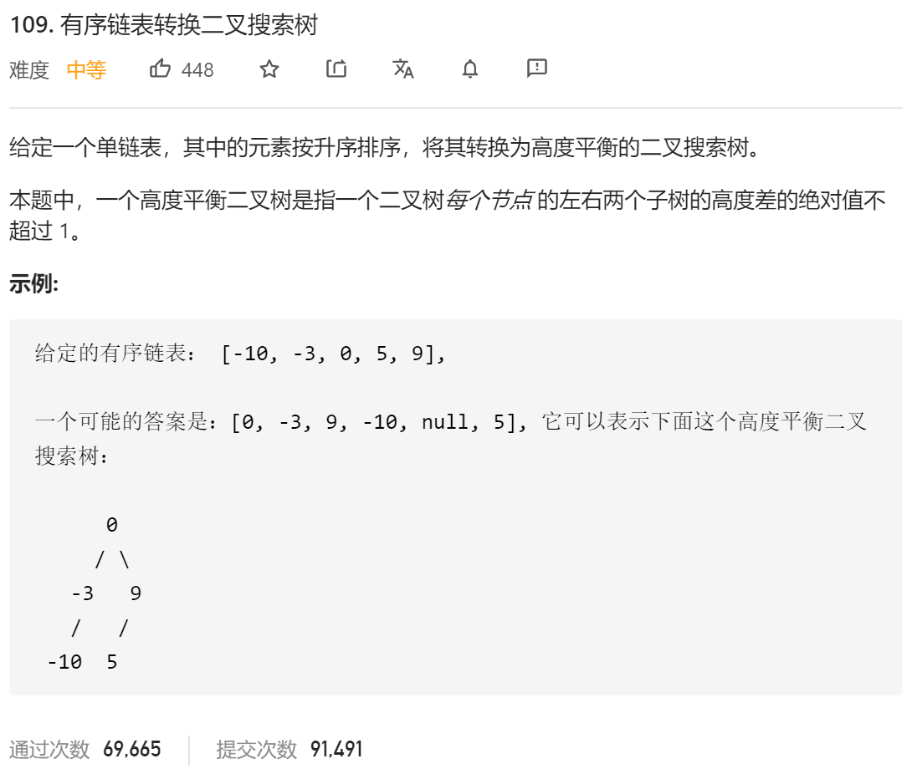

### leetcode_109_medium_有序链表转换二叉搜索树



```c++
class Solution {
public:
    TreeNode* sortedListToBST(ListNode* head) {
        
    }
};
```

#### 另外开辟空间的方法

构造一个vector<int> 用来存储链表中的元素。这样，问题就转化为了leetcode_108_easy_将有序数组转换为二叉搜索树。

算法空间复杂度O(n)，是几种方法中空间复杂度最高的。而且也不是该题想要考察的算法。

代码略

#### 分治+中序遍历

可以认为，链表的元素顺序，就是对于平衡二叉树的中序遍历的结果。

类似 leetcode_108_easy_将有序数组转换为二叉搜索树 ，分治地解决问题。将前一半划归为左子树，中间结点作为根节点，后一半划归为右子树。扫描一遍树的长度，作为划分的依据。

```c++
class Solution {
public:
	TreeNode* sortedListToBST(ListNode* head) {
		int length;
		ListNode* pCur;

		length = 0;
		pCur = head;
		while (pCur != nullptr)
		{
			pCur = pCur->next;
			length++;
		}
		return buildSubTree(head, length);
	}

	//以startNode链表起点，长度为length的链表，构造子树
	//(node为引用传参，函数结束后移动至下一个待使用的链表节点)
	TreeNode* buildSubTree(ListNode* &node,int length)
	{
		int leftLength, rightLength;
		TreeNode* result;
		if (length == 0)
			return nullptr;
		leftLength = length / 2;
		if (length % 2 == 1)  //判断length的奇偶性，以此决定右子树的长度
			rightLength = length / 2;
		else
			rightLength = length / 2 - 1;
		result = new TreeNode();
		//构造左子树
		result->left = buildSubTree(node, leftLength);
		//赋值根节点
		result->val = node->val;
		node = node->next;
		//构造右子树
		result->right = buildSubTree(node, rightLength);

		return result;
	}
};
```

