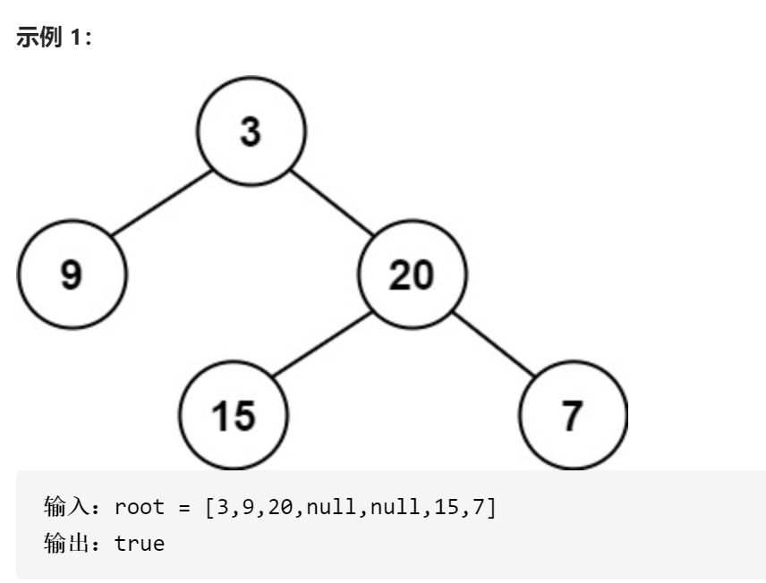
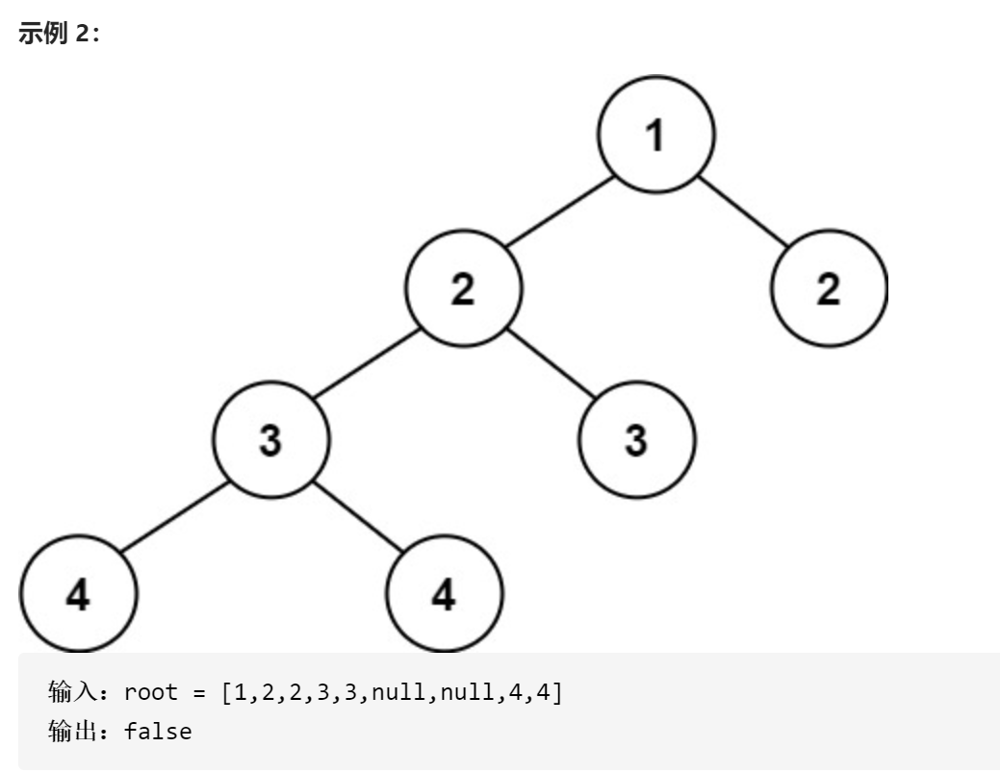
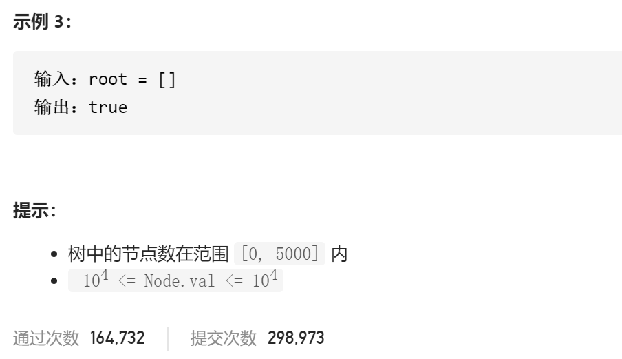

### leetcode_110_easy_平衡二叉树








```c++
class Solution {
public:
    bool isBalanced(TreeNode* root) {

    }
};
```

#### 算法思路

判断root是否为平衡二叉树，要判断3个条件

- 左右子树 深度的差是否超过1
- 左子树是否为平衡二叉树
- 右子树是否为平衡二叉树

条件1容易判断。分别计算左右子树的深度即可。计算深度要用递归的方法，不再赘述。

至于 要判断左右子树是否为平衡二叉树，可以在计算深度的时候顺便计算

```c++
class Solution {
public:
	bool isBalanced(TreeNode* root) {
		return !(depth(root) == -1);
	}

	//计算树的深度。如果数非平衡的话，返回-1
	int depth(TreeNode* root)
	{
		int depthLeft, depthRight;
		if (root == nullptr)
			return 0;
		depthLeft = depth(root->left);
		depthRight = depth(root->right);
		if (depthLeft == -1 || depthRight == -1)
			return -1;
		else if (abs(depthLeft - depthRight) > 1)
			return -1;
		else
			return max(depthLeft, depthRight) + 1;
	}
};
```

