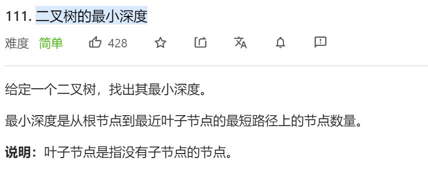
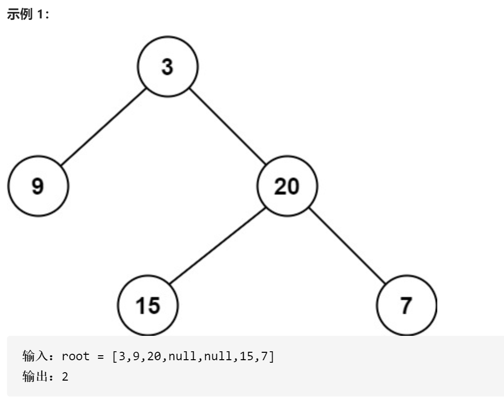
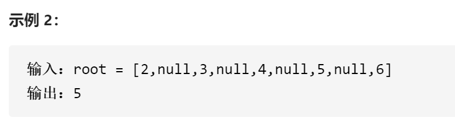

### leetcode_111_easy_二叉树的最小深度








#### 算法思路

分治+递归

- 对于空树nullptr，认为它的深度为0
- 一般情况，认为节点的深度，是min(左子树深度，右子树深度)+1
- 特殊情况。空树不是指向某个叶子节点的路径。如果节点的某个子树是空树的话，这个空树不能参与上述讨论

```c++
class Solution {
public:
	int minDepth(TreeNode* root) {
		int leftDepth,rightDepth,result = INT_MAX;
		//认为空节点的深度为0
		if (root == nullptr)  
			return 0;
		//左子树深度
		leftDepth = minDepth(root->left);
		//右子树深度
		rightDepth = minDepth(root->right);
		//左右子树均无法引向叶子节点(节点本身就是叶子节点)
		if (leftDepth == 0 && rightDepth == 0)
			return 1;
		//左右子树至少其一可以引向叶子节点
		if (leftDepth > 0)
			result = min(result, leftDepth + 1);
		if (rightDepth > 0)
			result = min(result, rightDepth + 1);
		return result;
	}
};
```

