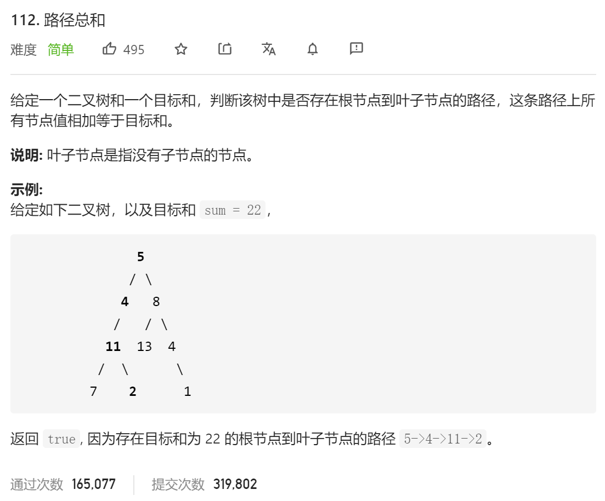

### leetcode_112_easy_路径总和



```c++
class Solution {
public:
    bool hasPathSum(TreeNode* root, int sum) {
        
    }
};
```

#### 算法思路

**递归**。判断是否存在路径，使得从叶子节点到root的和为sum。相当于

- 判断是否存在路径，使得叶子节点到root->left的和为sum-root->val
- 判断是否存在路径，使得叶子节点到root->right的和为sum-root->val

注意叶子节点的判断。体现在代码中

```c++
class Solution {
public:
	bool hasPathSum(TreeNode* root, int sum) {
		//空树，并不存在根到叶子节点的路径
		if (root == nullptr)
			return false;
		//对于叶子节点，判断是否符合
		if (root->left == nullptr && root->right == nullptr)
			return root->val == sum;
		//对于非叶子节点，判断左右子树是否有其一符合
		else
			return hasPathSum(root->left, sum - root->val)
			|| hasPathSum(root->right, sum - root->val);
	}
};
```

