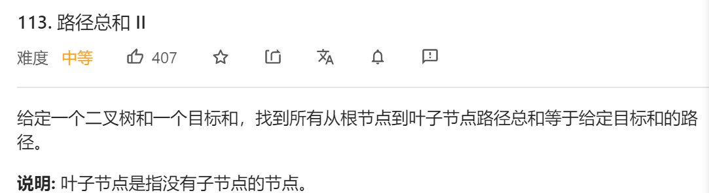
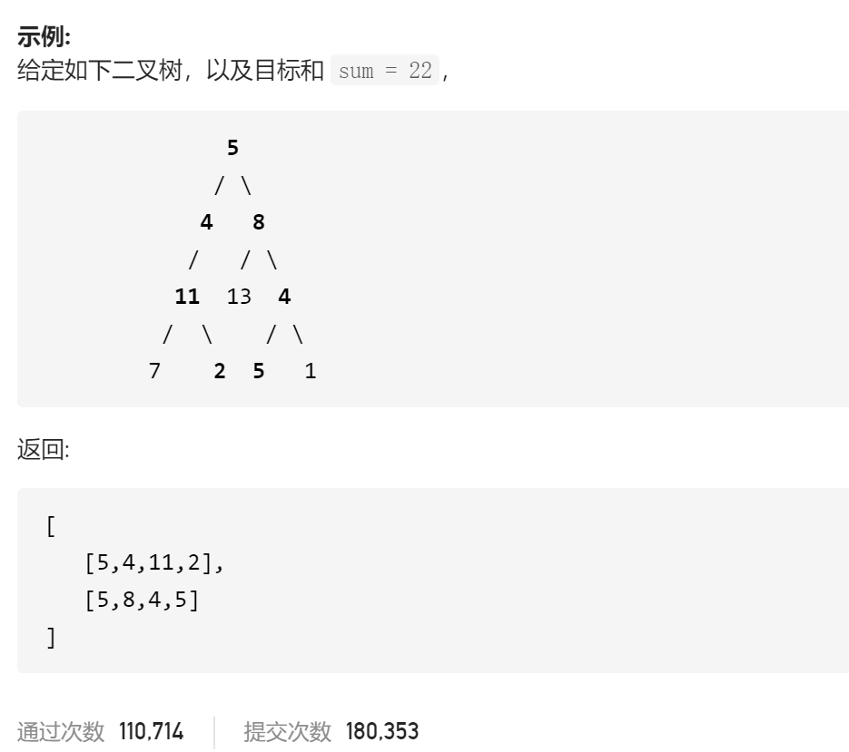

### leetcode_113_medium_路径总和Ⅱ





```c++
class Solution {
public:
    vector<vector<int>> pathSum(TreeNode* root, int sum) {
        
    }
};
```

#### 算法思路

可以理解为，搜索这样的路径，满足从根节点到叶子节点的路径总和 等于给定目标和。

对于这样的搜索问题，可以使用**回溯**算法

```c++
class Solution {
public:
	vector<vector<int>> pathSum(TreeNode* root, int sum) {
		vector<int> curPath;
		vector<vector<int>> results;
		
		if (root == nullptr)
			return results;
		backtrack(root, sum, curPath, results);
		return results;
	}

	void backtrack(TreeNode* root, int target, vector<int> &curPath, vector<vector<int>> &results)
	{
		//判断叶子节点
		if (root->left == nullptr && root->right == nullptr)
		{
			if (target == root->val)
			{
				curPath.push_back(root->val);
				results.push_back(curPath);
				curPath.pop_back();
			}
			return;
		}
		//搜索左子树
		if (root->left)
		{
			curPath.push_back(root->val);
			backtrack(root->left, target - root->val, curPath, results);
			curPath.pop_back();
		}
		//搜索右子树
		if (root->right)
		{
			curPath.push_back(root->val);
			backtrack(root->right, target - root->val, curPath, results);
			curPath.pop_back();
		}
	}
};
```

