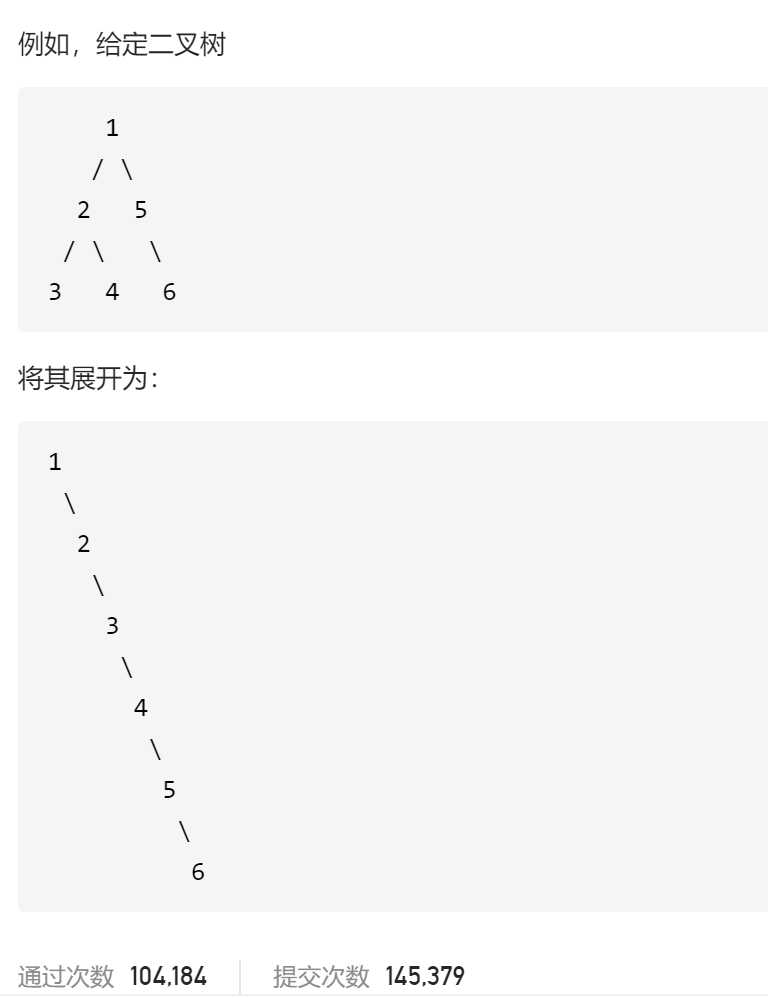

### leetcode_114_medium_二叉树展开为链表




```c++
class Solution {
public:
    void flatten(TreeNode* root) {

    }
};
```

#### 算法思路

**递归**的思路。将root展开为单链表分为几步

1. 将左子树root->left展开为单链表
2. 将右子树root->right展开为单链表
3. 将左子树尾节点的后继，指向右子树
4. 将root的右孩子 指向右子树

```c++
class Solution {
public:
	void flatten(TreeNode* root) {
		if (root != nullptr)
			flattenTree(root);
	}

	//将非空二叉树展开为单链表，并返回其最后一个节点
	TreeNode* flattenTree(TreeNode* root)
	{
		TreeNode *leftTreeEnd, *rightTreeEnd;
		//展平左子树
		if (root->left == nullptr)
			leftTreeEnd = root;  //leftTreeEnd存在的意义，是用来连接左右子树
		else
			leftTreeEnd = flattenTree(root->left);
		//展平右子树
		if (root->right == nullptr)
			rightTreeEnd = leftTreeEnd;  //rightTreeEnd存在的意义，是作为整棵树的末尾节点
		else
			rightTreeEnd = flattenTree(root->right);
		//连接左右子树
		if (root->left)  //如果左子树非空，则需要把左子树插入到右边
		{
			leftTreeEnd->right = root->right;
			root->right = root->left;
			root->left = nullptr;
		}
		return rightTreeEnd;
	}
};
```

