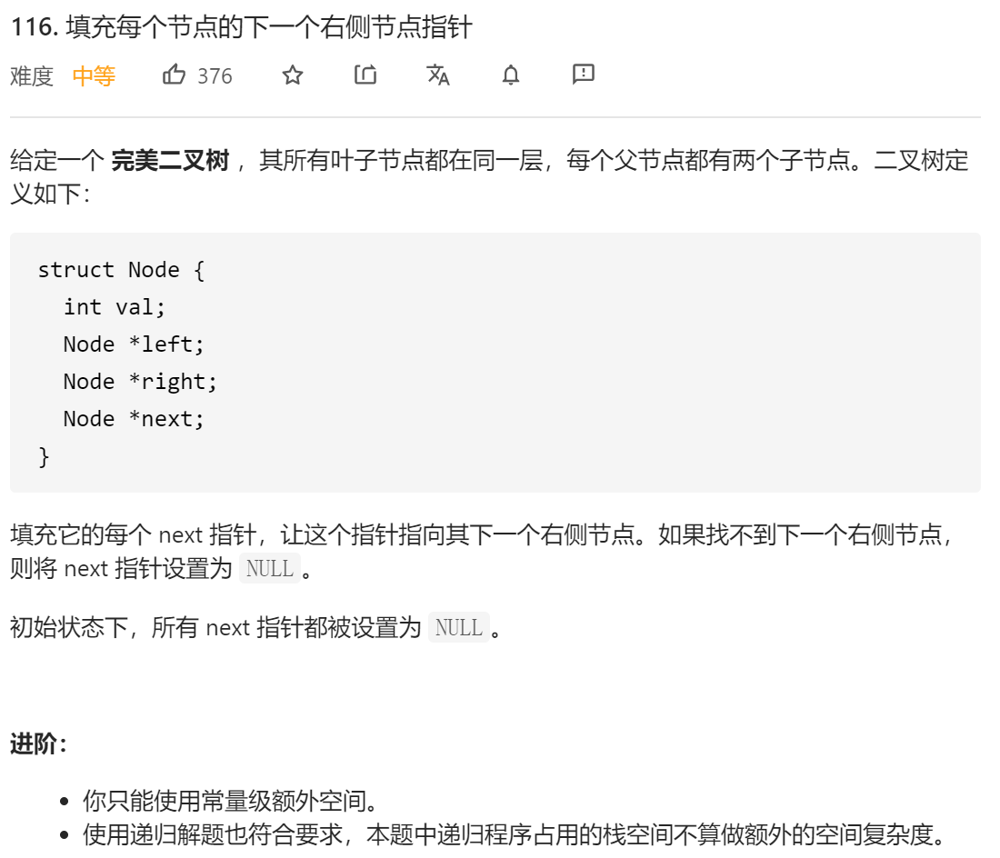

### leetcode_116_medium_填充每个节点的下一个右侧节点指针



```c++
/*
// Definition for a Node.
class Node {
public:
    int val;
    Node* left;
    Node* right;
    Node* next;

    Node() : val(0), left(NULL), right(NULL), next(NULL) {}

    Node(int _val) : val(_val), left(NULL), right(NULL), next(NULL) {}

    Node(int _val, Node* _left, Node* _right, Node* _next)
        : val(_val), left(_left), right(_right), next(_next) {}
};
*/

class Solution {
public:
    Node* connect(Node* root) {
        
    }
};
```

#### 层序遍历的改动

看到示例，直观地想到二叉树的层序遍历。类比 leetcode_102_medium_二叉树的层序遍历 在其基础上，作简单改动，按层访问时将next指针指向下一个节点或nullptr即可。

不过，该方法空间复杂度O(log n)，不符合“进阶”的O(1)空间复杂度要求

#### 层序遍历的指针实现

对于题目中描述的**满二叉树**，其节点，总有2个子数(左/右)，或1个子树(左)，或0个子树。为了连接next指针，考虑，每当访问到一个节点时，都处理其子树的next指针问题

当访问到一个节点pCur时，处理其子树的next指针方法如下:

- 如果有左子树，左孩子的next
  - 如果有右子树，指向右子树
  - 如果没有右子树，指向nullptr
- 如果有右子树
  - 如果pCur有next节点，指向pCur->next->left
  - 如果pCur没有next节点，指向nullptr

处理pCur的迭代问题

- 如果有next节点，指向next节点
- 如果没有next节点，指向下一行的头结点

此算法空间复杂度O(1)

```c++
class Solution {
public:
	Node* connect(Node* root) {
		Node *pCur, *pNextLine;
		
		pCur = root;
		if(root)
			pNextLine = root->left;
		while (pCur != nullptr)
		{
			//处理左孩子
			if (pCur->left)
			{
				if (pCur->right)
					pCur->left->next = pCur->right;
				else
					pCur->left->next = nullptr;
			}
			//处理右孩子
			if (pCur->right)
			{
				if (pCur->next)
					pCur->right->next = pCur->next->left;
				else
					pCur->next = nullptr;
			}
			//迭代pCur
			if (pCur->next)
				pCur = pCur->next;
			else  //转到下一行
			{
				if (pNextLine)
				{
					pCur = pNextLine;
					pNextLine = pCur->left;
				}
				else
					break;
				
			}
		}
		return root;
	}
};
```

