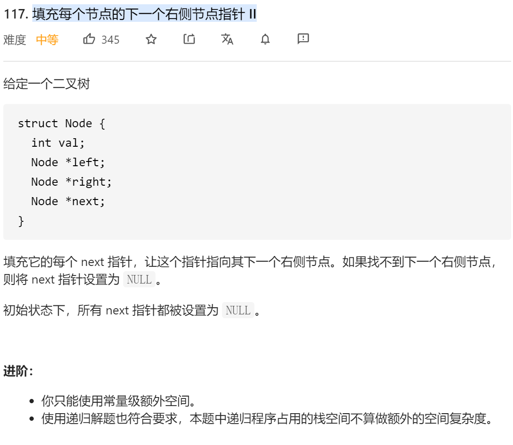
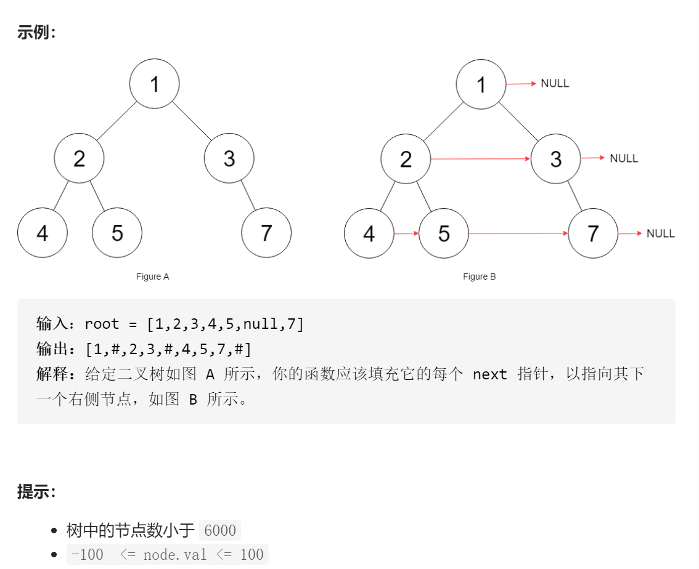

### leetcode_117_medium_填充每个节点的下一个右侧节点指针 II





```c++
class Solution {
public:
    Node* connect(Node* root) {
        
    }
};
```

#### 算法思路

类似 leetcode_116_medium_填充每个节点的下一个右侧节点指针 。唯一的不同，是本题的二叉树不限制为满二叉树。

同样的流程，迭代访问每一个节点pCur，分别处理其左右孩子的next指针。区别在于，其孩子的next指针，指向的位置可能很后面。 因此，在寻找其next指针指向的同时，顺便找到下一个待访问的节点。

```c++
class Solution {
public:
	Node* connect(Node* root) {
		Node *pCur, *pNext=nullptr, *pNextLine=nullptr;

		if (root == nullptr)
			return nullptr;
		if (root->left)
			pNextLine = root->left;
		else if (root->right)
			pNextLine = root->right;
		pCur = root;
		while (pCur)
		{
			pNext=pCur->next;  //pNext指向 在pCur之后的本行范围内，下一个有孩子的节点，或者nullptr
			while (pNext && pNext->left == nullptr && pNext->right == nullptr)
				pNext = pNext->next;
			//处理左孩子
			if (pCur->left)
			{
				if (pCur->right)
					pCur->left->next = pCur->right;
				else
				{
					if (pNext)
						pCur->left->next = pNext->left ? pNext->left : pNext->right;
				}
			}
			//处理右孩子
			if (pCur->right)
			{
				if (pNext)
					pCur->right->next = pNext->left ? pNext->left : pNext->right;
			}
			//迭代pCur
			if (pNext == nullptr)  //检测是否需要换行
			{
				pNext = pNextLine;  //下一行的首节点
				while (pNextLine && pNextLine->left == nullptr && pNextLine->right == nullptr)  //寻找下下行的首节点
					pNextLine = pNextLine->next;
				if (pNextLine != nullptr)  //这意味着存在下下行
					pNextLine = pNextLine->left ? pNextLine->left : pNextLine->right;
			}
			pCur = pNext;
		}
		return root;
	}
};
```

