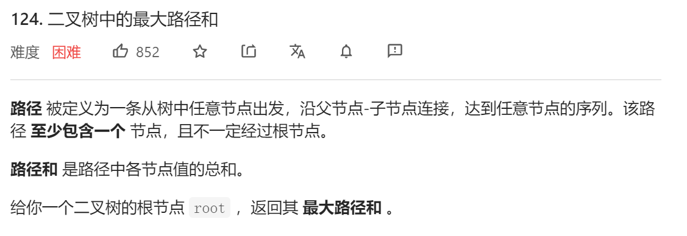
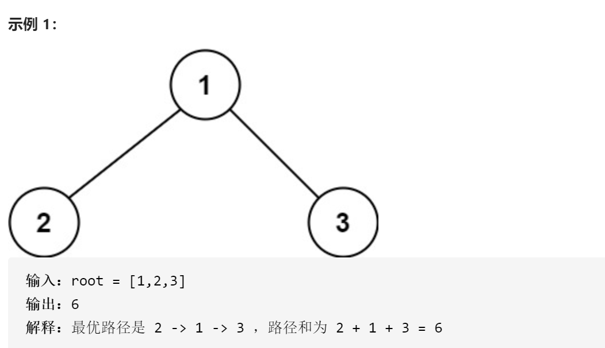
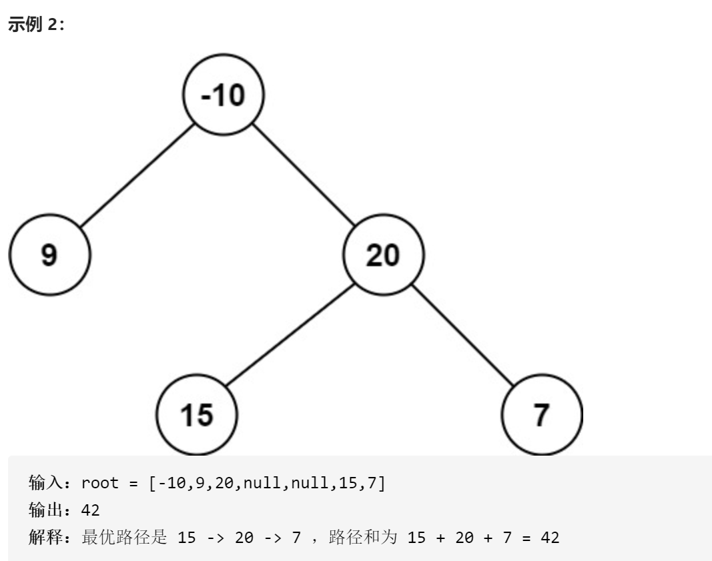
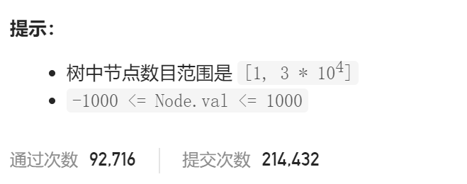

### leetcode_124_hard_二叉树中的最大路径和









```c++
class Solution {
public:
    int maxPathSum(TreeNode* root) {

    }
};
```

#### 算法思路

可以将题目转化为，经过节点

对于树中的每一个节点node，讨论当它在路径中时，可以为路径和贡献多少

- 如果它作为路径的根节点，则 总路径和=左子树路径和+node->val+右子树路径和
- 如果它不作为路径的根节点，则其左、右子树 只能采用其一。则 部分路径和=root->val+max(左子树部分路径和，右子树部分路径和)

由上述讨论，可以递归地遍历每一个节点，计算以它为根节点的路径和，并返回不以它为根节点的部分和

```c++
class Solution {
public:
	int maxPathSum(TreeNode* root) {
		int result;

		result = INT_MIN;
		partSum(root, result);
		return result;
	}

	//返回不以root为根节点的部分路径和
	//以root为根节点的路径和，借此更新result
	int partSum(TreeNode* root, int &result)
	{
		int leftSum, rightSum;  //左、右子树贡献的部分路径和
		
		if (root == nullptr)
			return 0;
		leftSum = partSum(root->left, result);
		rightSum = partSum(root->right, result);
		//讨论以当前节点为根节点的路径和
		result = max(result, root->val + leftSum + rightSum);
		//讨论不以当前节点为根节点的部分和
		return max(0, root->val + max(leftSum, rightSum));
	}
};
```

