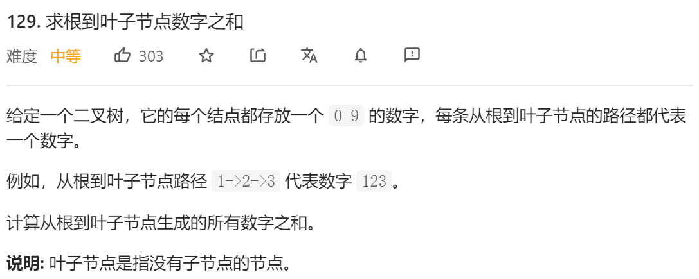
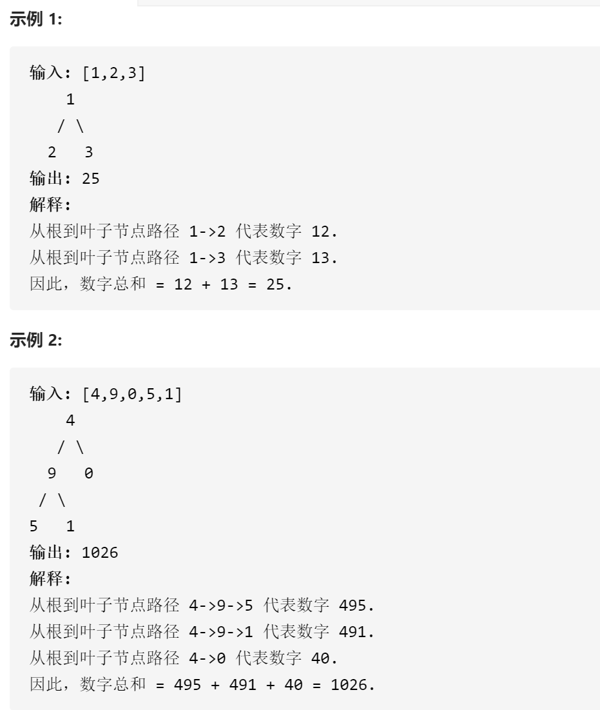

### leetcode_129_medium_求根到叶子节点数字之和






```c++
class Solution {
public:
    int sumNumbers(TreeNode* root) {

    }
};
```

#### 算法思路

以示例2为例。在根节点 数字是4。访问到节点9，数字变为4 * 10 + 9 = 49。访问到节点5，数字变为49 * 10 + 5 = 495。

按照以上思路，递归地处理，具体见代码

```c++
class Solution {
public:
	int sumNumbers(TreeNode* root) {
		if (root)
			return partSum(0, root);
		else
			return 0;
	}

	//根据父节点的数值，求当前子树的部分和(保证当前子树非空)
	int partSum(int curNum, TreeNode* root)
	{
		int result = 0;
		curNum *= 10;
		curNum += root->val;
		if (!root->left && !root->right)  //叶子节点 意味着部分和的计算到此结束
		{
			return curNum;
		}
		if (root->left)
			result += partSum(curNum, root->left);  //左子树的部分和
		if (root->right)
			result += partSum(curNum, root->right);  //右子树的部分和
		return result;
	}
};
```

