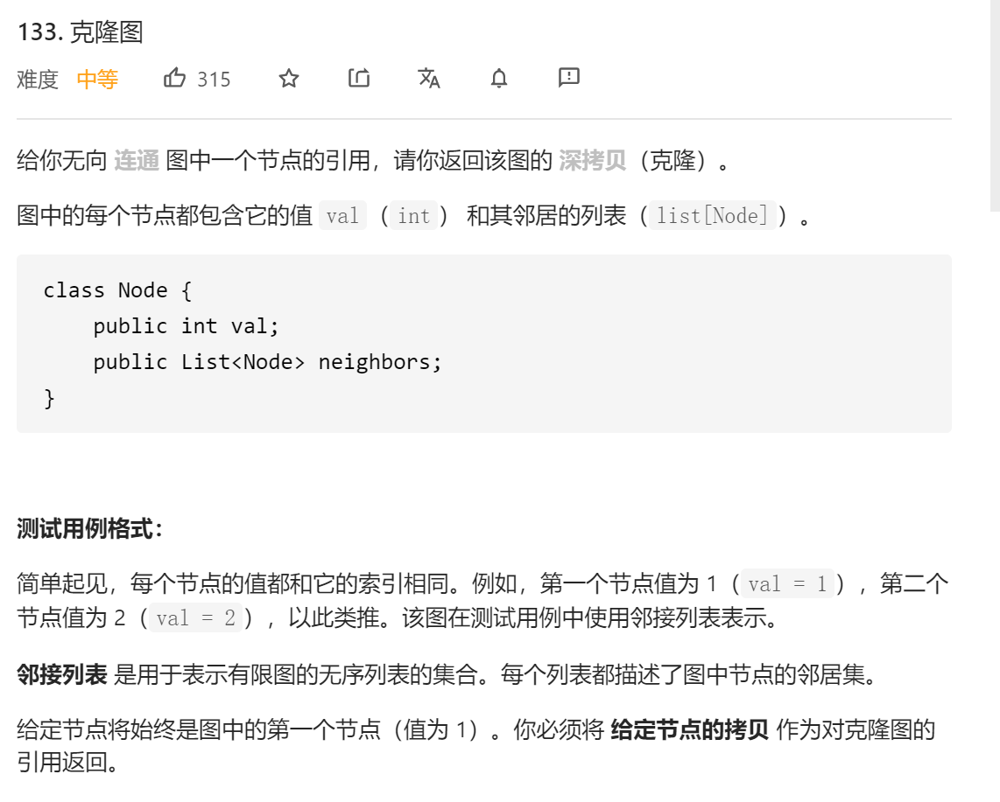
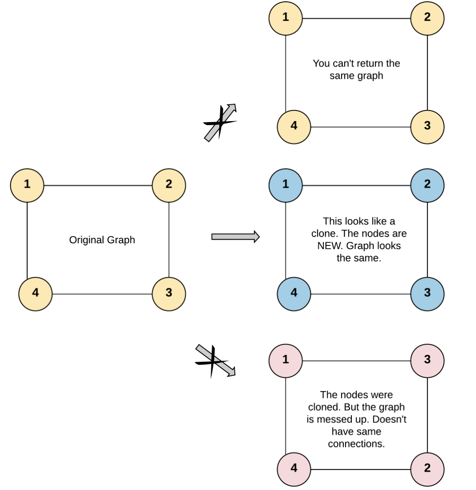
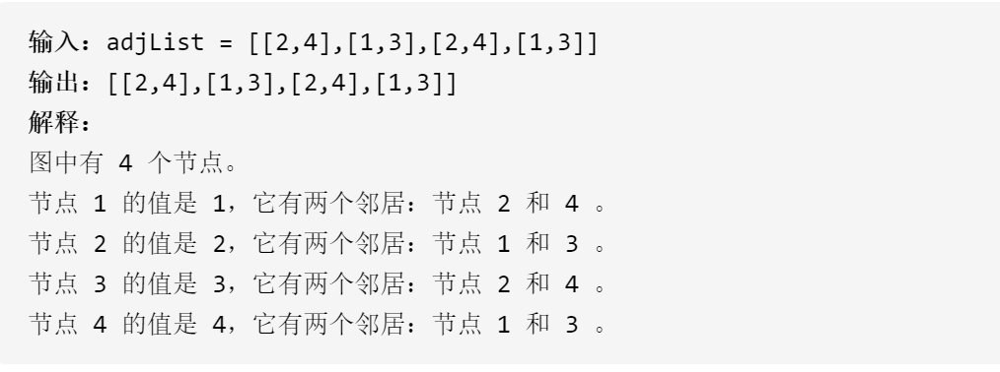
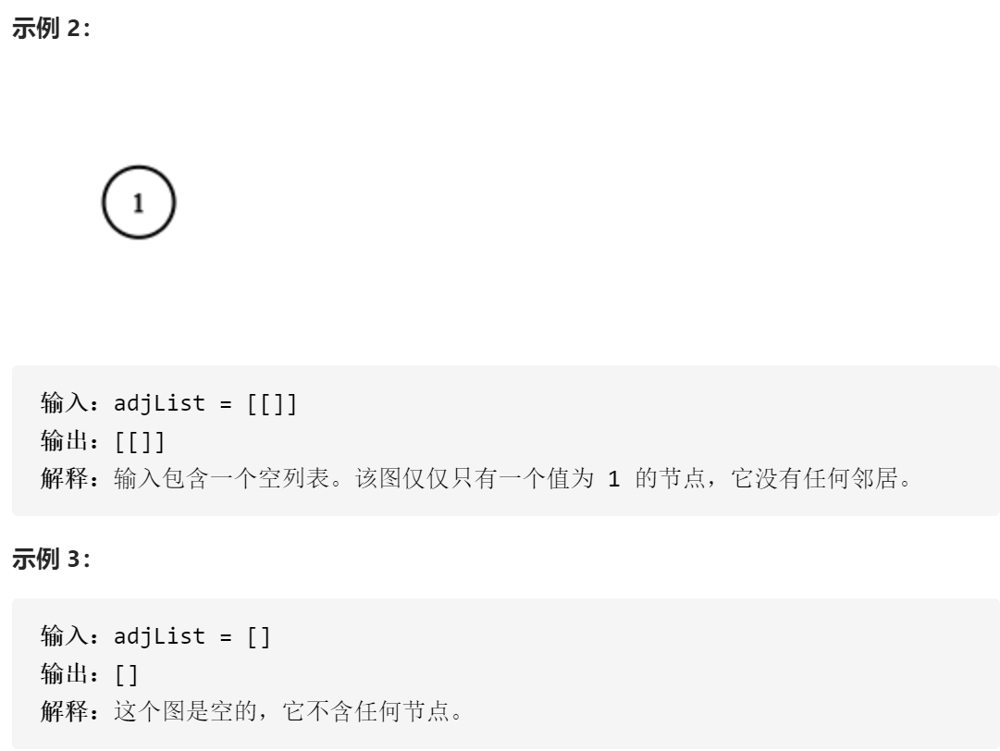
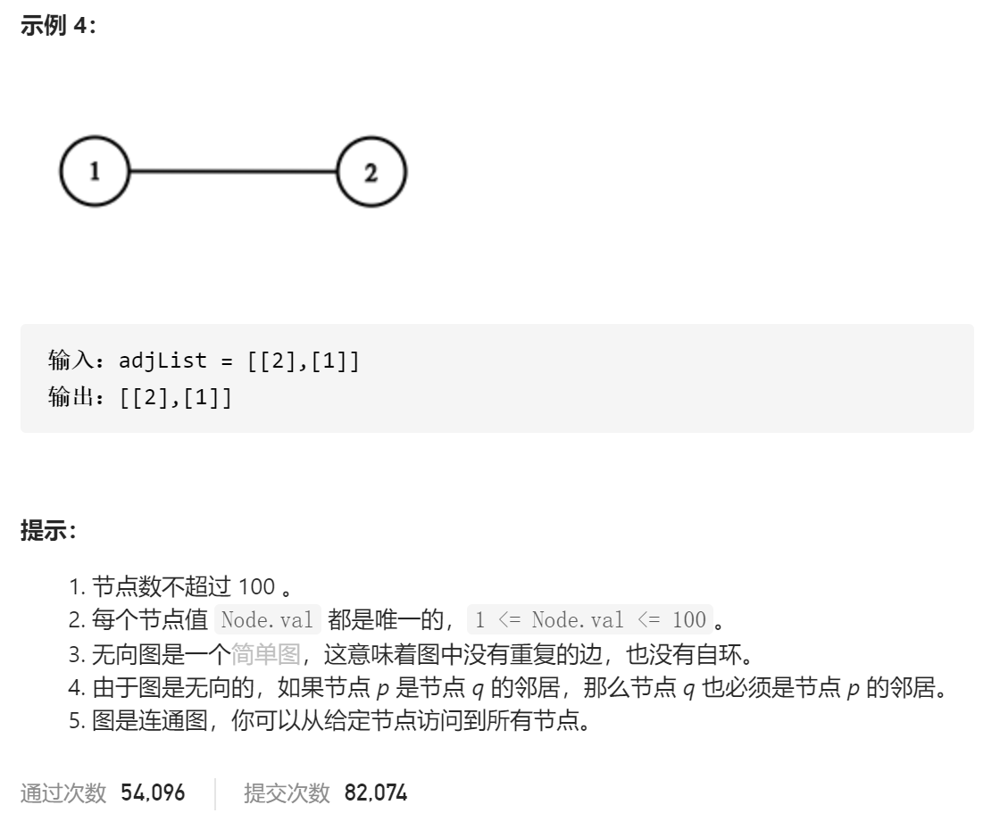

### leetcode_133_medium_克隆图












```c++
/*
// Definition for a Node.
class Node {
public:
    int val;
    vector<Node*> neighbors;
    Node() {
        val = 0;
        neighbors = vector<Node*>();
    }
    Node(int _val) {
        val = _val;
        neighbors = vector<Node*>();
    }
    Node(int _val, vector<Node*> _neighbors) {
        val = _val;
        neighbors = _neighbors;
    }
};
*/

class Solution {
public:
    Node* cloneGraph(Node* node) {
        
    }
};
```

#### 算法思路

深度优先遍历原图。将新的图的节点指针，存放在hashmap中。当深度优先处理到某个节点node时，对于节点的每个邻接节点

- 如果该邻接节点未被创建，则
  - 创建该节点，存储在hashmap中
  - 令node与该新节点相连
  - 继续深度优先访问该邻接节点
- 如果该邻接节点已经被创建，则令node与该节点相连

```c++
class Solution {
public:
	Node* cloneGraph(Node* node) {
		unordered_map<int, Node*> nodeMap;  //记录克隆图 val到节点指针 的映射

		if (node == nullptr)
			return nullptr;
		nodeMap[node->val] = new Node(node->val);
		DFS(node, nodeMap[node->val], nodeMap);
		return nodeMap[node->val];
	}

	void DFS(Node *pSrc, Node *pDst, unordered_map<int, Node*> &nodeMap)
	{
		int i,value;

		for (i = 0; i < pSrc->neighbors.size(); i++)
		{
			value = pSrc->neighbors[i]->val;
			if (nodeMap.find(value) == nodeMap.end())  //如果该节点尚未被创建
			{
				nodeMap[value] = new Node(value);  //创建该节点
				pDst->neighbors.push_back(nodeMap[value]);  //与该节点相连
				DFS(pSrc->neighbors[i], nodeMap[value], nodeMap);  //深度优先访问该节点

			}
			else
				pDst->neighbors.push_back(nodeMap[value]);  //与该节点相连
		}
	}
};
```

