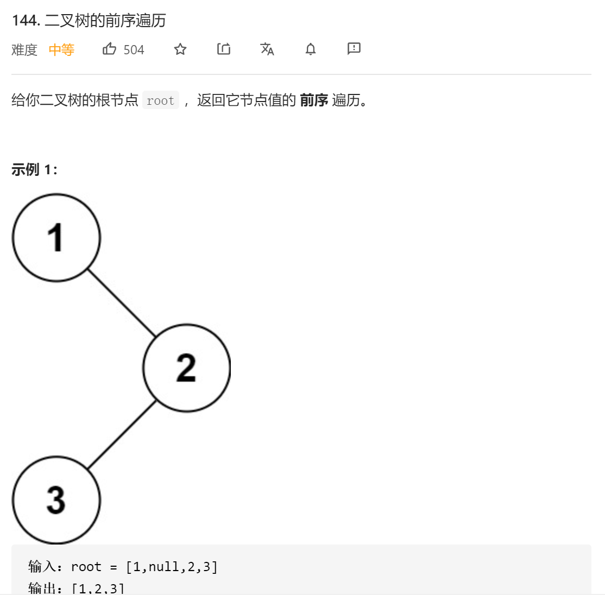
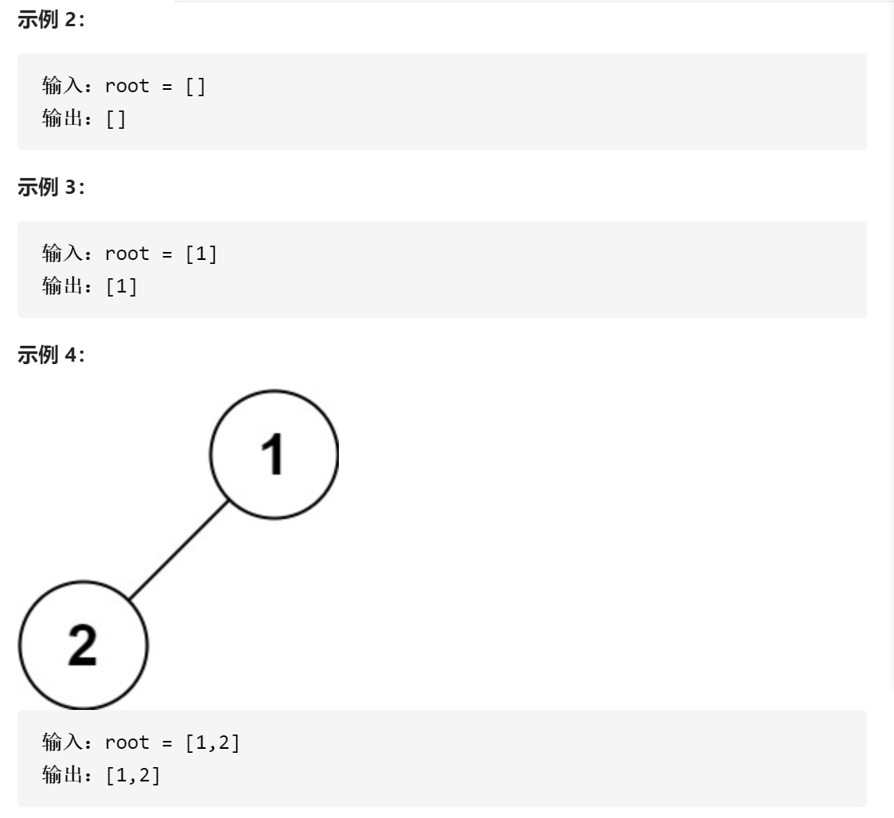
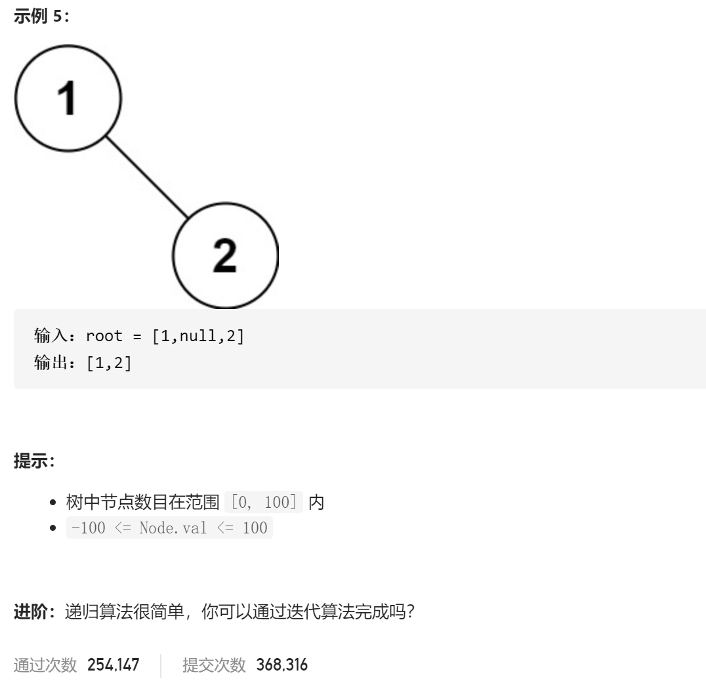

### leetcode_144_medium_二叉树的前序遍历







```c++
class Solution {
public:
    vector<int> preorderTraversal(TreeNode* root) {

    }
};
```

#### 递归

```c++
class Solution {
public:
	vector<int> preorderTraversal(TreeNode* root) {
		vector<int> result;
		preorder(root, result);
		return result;
	}

	void preorder(TreeNode *root, vector<int> &res)
	{
		if (!root)
			return;
		res.push_back(root->val);
		preorder(root->left,res);
		preorder(root->right, res);

	}
};
```

#### 迭代

使用一个指向节点的指针 TreeNode *pCur，进行迭代访问。

先序遍历的顺序为，先访问根节点，再访问左子树，再访问右子树。因此，pCur的访问顺序也是，先访问自身的val，再访问左子树。为了将来能够找到右子树，需要将pCur入栈。对于从栈中取得的节点，其左子树已被访问过，故只需访问右子树。

1. pCur首先指向根节点

- 当pCur非空
  - 访问pCur->val
  - pCur入栈
  - pCur指向pCur->left
- 当pCur为空
  - pCur指向栈顶元素。弹栈。
  - pCur指向pCur->right

```c++
class Solution {
public:
	vector<int> preorderTraversal(TreeNode* root) {
		TreeNode *pCur;
		stack<TreeNode*> stk;
		vector<int> result;

		pCur = root;
		while (pCur || !stk.empty())
		{
			while (pCur)
			{
				result.push_back(pCur->val);
				stk.push(pCur);
				pCur = pCur->left;
			}
			pCur = stk.top();
			stk.pop();
			pCur = pCur->right;
		}
		return result;
	}
};
```

