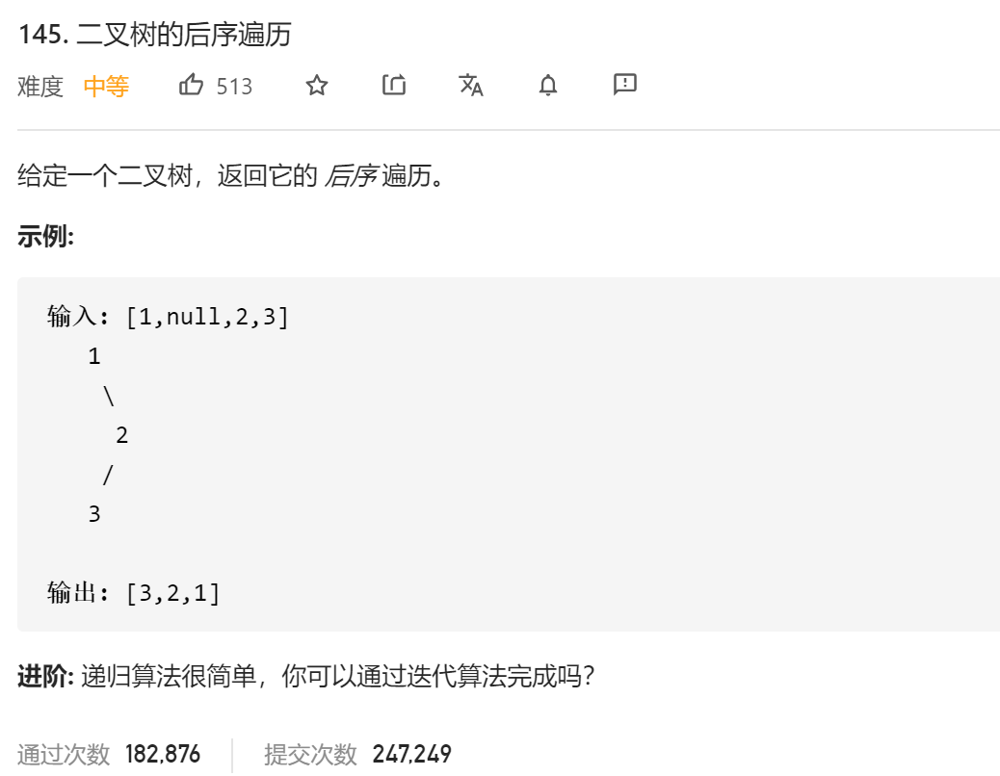

### leetcode_145_medium_二叉树的后序遍历



```c++
class Solution {
public:
    vector<int> postorderTraversal(TreeNode* root) {

    }
};
```

#### 递归

```c++
class Solution {
public:
	vector<int> postorderTraversal(TreeNode* root) {
		vector<int> result;
		postorder(root,result);
		return result;
	}

	void postorder(TreeNode *root, vector<int> &res)
	{
		if (!root)
			return;
		postorder(root->left, res);
		postorder(root->right, res);
		res.push_back(root->val);
	}
};
```

#### 迭代(右子树优先的前序遍历的翻转)

类似 leetcode_144_medium_二叉树的前序遍历 。不同的的是，后序遍历是先访问左子树、右子树，最后访问根节点。

其实，后序遍历得到的遍历结果，也就是下述遍历方式的翻转：先访问右子树，再访问左子树，再访问根节点。

```c++
class Solution {
public:
	vector<int> postorderTraversal(TreeNode* root) {
		TreeNode* pCur;
		vector<int> result;
		stack<TreeNode*> stk;

		pCur = root;
		while (pCur || !stk.empty())
		{
			while (pCur)
			{
				result.push_back(pCur->val);
				stk.push(pCur);
				pCur = pCur->right;
			}
			pCur = stk.top();
			stk.pop();
			pCur = pCur->left;
		}
		reverse(result.begin(), result.end());
		return result;
	}
};
```

