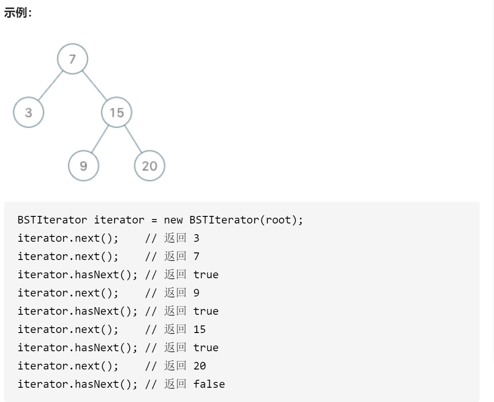
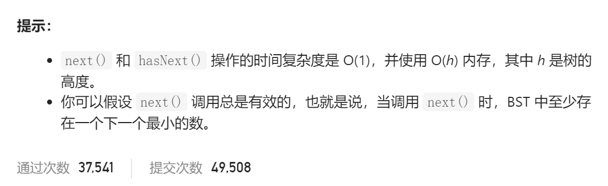

### leetcode_173_medium_二叉搜索树迭代器






```c++
/**
 * Definition for a binary tree node.
 * struct TreeNode {
 *     int val;
 *     TreeNode *left;
 *     TreeNode *right;
 *     TreeNode() : val(0), left(nullptr), right(nullptr) {}
 *     TreeNode(int x) : val(x), left(nullptr), right(nullptr) {}
 *     TreeNode(int x, TreeNode *left, TreeNode *right) : val(x), left(left), right(right) {}
 * };
 */
class BSTIterator {
public:
    BSTIterator(TreeNode* root) {

    }
    
    int next() {

    }
    
    bool hasNext() {

    }
};

/**
 * Your BSTIterator object will be instantiated and called as such:
 * BSTIterator* obj = new BSTIterator(root);
 * int param_1 = obj->next();
 * bool param_2 = obj->hasNext();
 */
```

#### 算法思路

相当于是 **中序遍历二叉树，寻找下一个节点**

使用栈来模拟递归。将待处理的节点存储在一个stack<TreeNode*> 中

对于next操作 总是返回栈顶元素。如果栈顶元素的右孩子节点不为空，则处理右孩子。

```c++
class BSTIterator {
public:
	BSTIterator(TreeNode* root) {
		search(root);  //先将所有待处理的点加入队列
	}

	int next() {
		TreeNode* res = candidates.top();  //栈顶元素即为目前待处理的元素
		candidates.pop();  //该节点访问过了，就要出栈
		if (res->right)  //如果还有右孩子，则接下来准备处理右孩子
			search(res->right);
		return res->val;
	}

	bool hasNext() {
		return !candidates.empty();
	}

private:
	//对于一个子树，访问到它的最左叶节点
	void search(TreeNode* node)
	{
		while (node)
		{
			candidates.push(node);
			node = node->left;
		}
	}

private:
	stack<TreeNode*> candidates;
};
```

