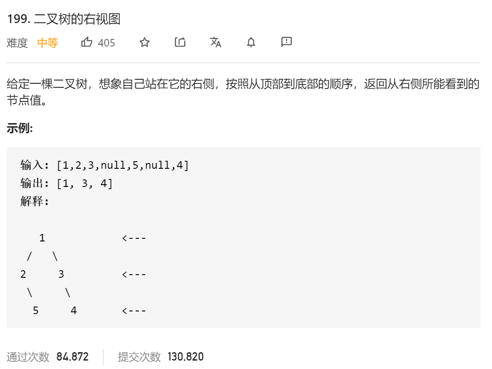

### leetcode_199_medium_二叉树的右视图



```c++
class Solution {
public:
    vector<int> rightSideView(TreeNode* root) {

    }
};
```

#### 算法思路

分别读取每行的节点。存储尾节点

```c++
class Solution {
public:
	vector<int> rightSideView(TreeNode* root) {
		int i;
		vector<TreeNode*> curLine, nextLine;
		vector<int> result;

		if (root != nullptr)
			curLine.push_back(root);
		while (!curLine.empty())
		{
			result.push_back(curLine[curLine.size() - 1]->val);
			for (i = 0; i < curLine.size(); i++)
			{
				if (curLine[i]->left)
					nextLine.push_back(curLine[i]->left);
				if (curLine[i]->right)
					nextLine.push_back(curLine[i]->right);
			}
			swap(curLine, nextLine);
			nextLine.clear();
		}
		return result;
	}
};
```

