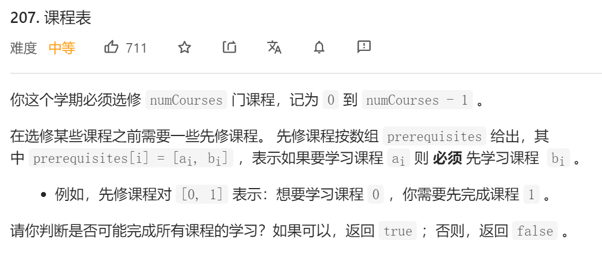
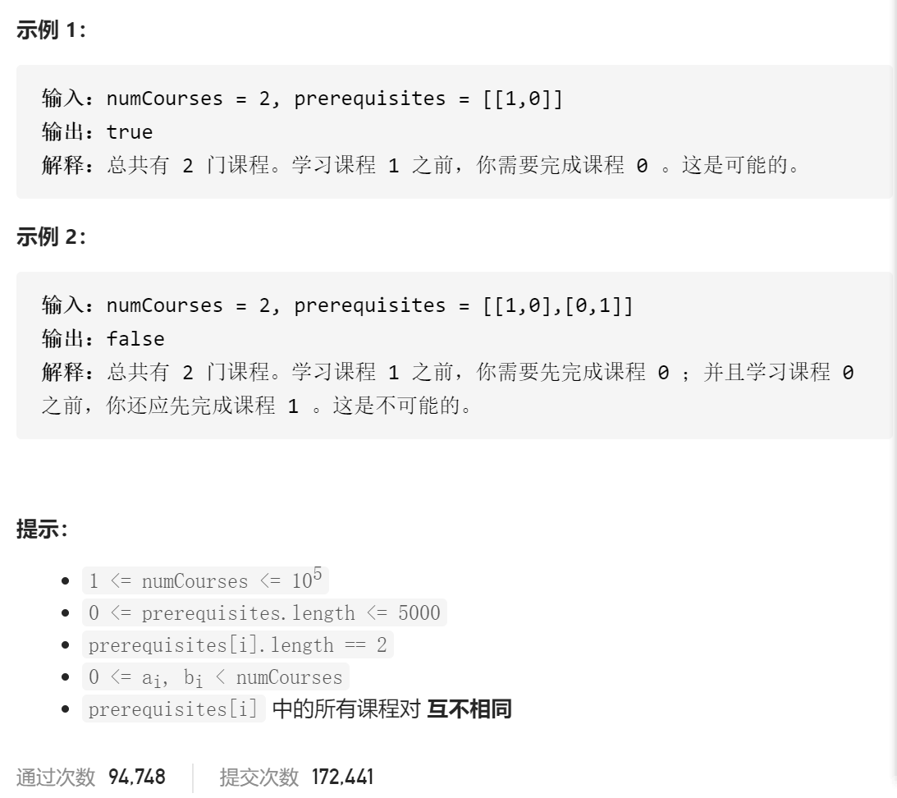

### leetcode_207_medium_课程表





```c++
class Solution {
public:
    bool canFinish(int numCourses, vector<vector<int>>& prerequisites) {

    }
};
```

#### dijkstra算法

dijkstra算法。为每个节点存储其前置依赖。用一个队列存储入度为0的点。如果能够通过队列的迭代，使得所有节点都被访问到，则成立

```c++
class Solution {
public:
	bool canFinish(int numCourses, vector<vector<int>>& prerequisites) {
		int i, curCourse;
		queue<int> candidates;  //目前入度为0的节点。即可以被学习的课程
		vector<int> inDegree(numCourses, 0);  //各个节点的入度数量
		vector<vector<int>> successor(numCourses);  //各个节点的后置节点

		//寻找各个节点的前置节点
		for (i = 0; i < prerequisites.size(); i++)
		{
			successor[prerequisites[i][1]].push_back(prerequisites[i][0]);  //更新前驱节点的后继
			inDegree[prerequisites[i][0]]++;  //更新后置节点的入度
		}
		//初始化 目前可使用的节点序列
		for (i = 0; i < numCourses; i++)
		{
			if (inDegree[i] == 0)
				candidates.push(i);
		}
		//dijkstra算法，迭代更新可被访问到的节点
		while (!candidates.empty())
		{
			curCourse = candidates.front();
			candidates.pop();
			numCourses--;
			for (i = 0; i < successor[curCourse].size(); i++)
			{
				inDegree[successor[curCourse][i]]--;
				if (inDegree[successor[curCourse][i]] == 0)
					candidates.push(successor[curCourse][i]);
			}
		}
		return numCourses == 0;
	}
};
```

#### DFS找环

如果存在环路依赖，则肯定无法完成所有课程。通过DFS找环

```c++
class Solution {
public:
	bool canFinish(int numCourses, vector<vector<int>>& prerequisites) {
		int i;
		vector<int> visited(numCourses, 0);  //各个节点的访问状态。0 尚未被访问过  -1 已被讨论过 1 在本轮中被访问过
		vector<vector<int>> edges(numCourses);  //有向图的边。从前驱课程指向后继课程

		//构建图
		for (i = 0; i < prerequisites.size(); i++)
		{
			edges[prerequisites[i][1]].push_back(prerequisites[i][0]);
		}
		//DFS找环
		for (i = 0; i < numCourses; i++)
		{
			if (DFS(i, visited, edges))  //如果从该点开始DFS有环，则无法修完课程
				return false;
		}
		return true;
	}

	//从某节点开始 遍历图。如果有环路则返回true 否则返回false
	bool DFS(int index, vector<int> &visited, vector<vector<int>> &edges)
	{
		int i;
		if (visited[index] == -1)  //-1表示该点已被完整讨论过，故无需再讨论
			return false;
		if(visited[index]==1)  //1表示在这轮DFS中 该点第二次被访问到。意味着有环
			return true;
		visited[index] = 1;  //该节点在本轮第一次被访问到，DFS尚未结束，标记为1
		for (i = 0; i < edges[index].size(); i++)
		{
			if (DFS(edges[index][i],visited, edges))
				return true;
		}
		visited[index] = -1;  //DFS结束后，该节点仍没有第二次被访问到。标记为-1
		return false;
	}
};
```

