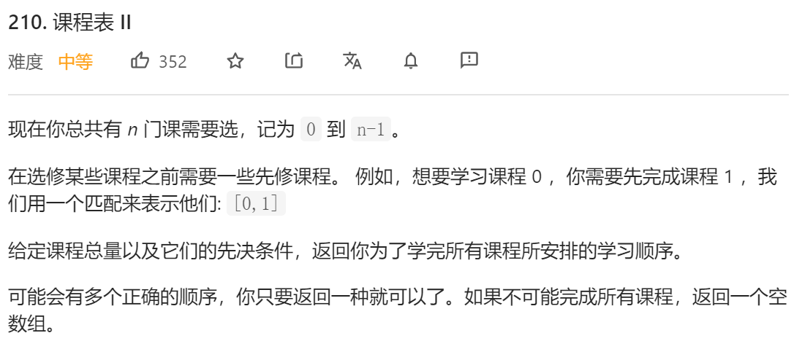
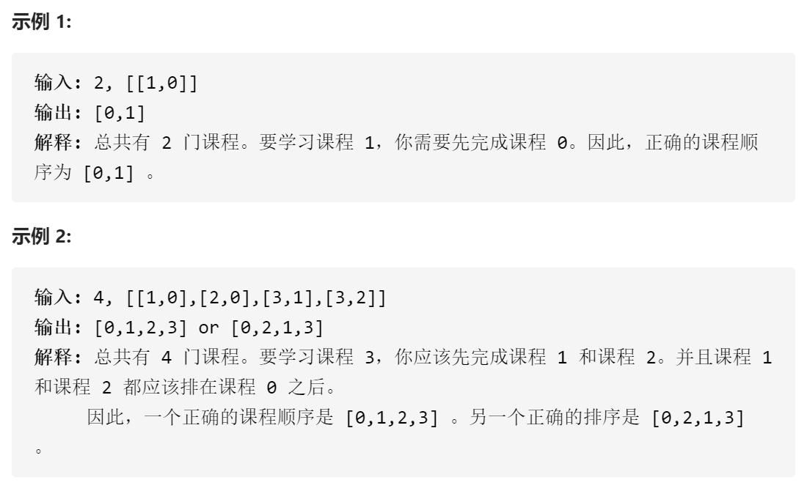
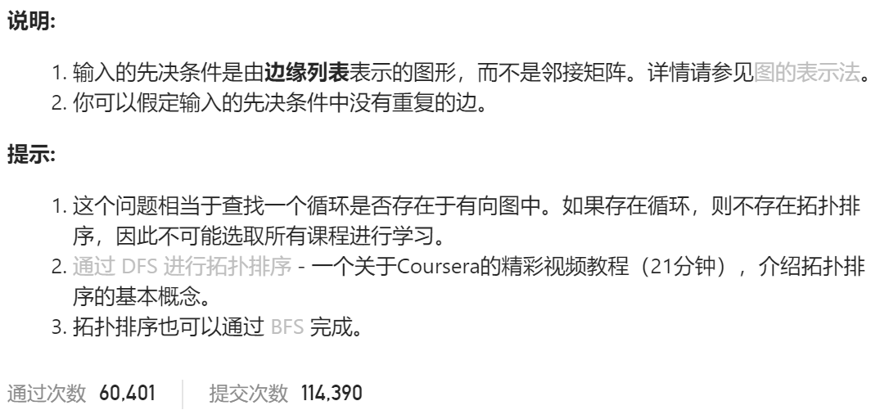

### leetcode_210_medium_课程表Ⅱ







```c++
class Solution {
public:
    vector<int> findOrder(int numCourses, vector<vector<int>>& prerequisites) {

    }
};
```

#### dijkstra算法

同leetcode_207_medium_课程表

