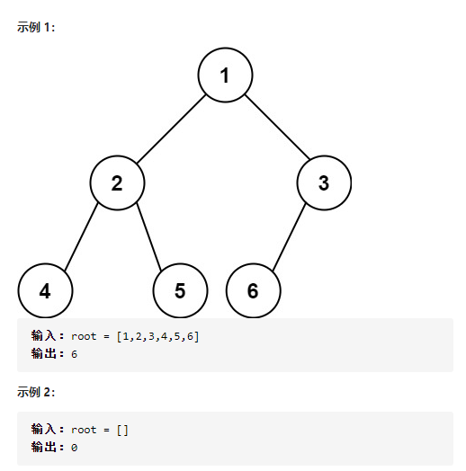
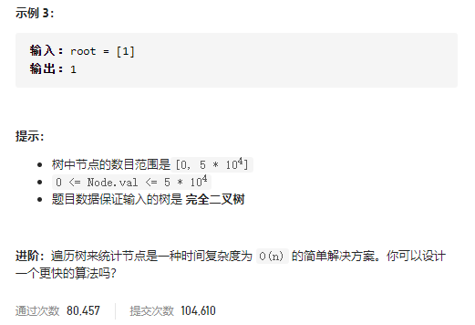

### leetcode_222_medium_完全二叉树的节点个数






```c++
class Solution {
public:
    int countNodes(TreeNode* root) {

    }
};
```

#### 遍历

递归地遍历所有节点，时间复杂度O(n)。

```c++
class Solution {
public:
	int countNodes(TreeNode* root) {
		if (root == nullptr)
			return 0;
		else
			return countNodes(root->left) + countNodes(root->right) + 1;
	}
};
```


#### 二分查找+位运算

参考官方题解https://leetcode-cn.com/problems/count-complete-tree-nodes/solution/wan-quan-er-cha-shu-de-jie-dian-ge-shu-by-leetco-2/

对于完全二叉树，很容易判断其深度。一直访问左子节点即可。

对于最深一层下标为h的完全二叉树，其节点数量在[2^h,2^(h+1)-1]区间内。对这个区间作二分查找即可。


如何讨论完全二叉树是否有第k个节点？可以采用位运算。如上图所示，第h行的元素，其对应的二进制数为h+1位。例如9 对应 二进制数(1001)，则除了第一位以外，按照二进制位顺序，0表示访问左子树，1表示访问右子树

```c++
class Solution {
public:
	int countNodes(TreeNode* root) {
		int height, left, right, mid;
		TreeNode *cur;

		//判断树的深度
		height = 0;
		cur = root;
		while (cur)
		{
			height++;
			cur = cur->left;
		}
		if (height == 0)
			return 0;
		//二分查找 找到树的最后一个节点下标(下标从1开始)
		left = 1 << (height - 1);  //二叉树节点数最小值
		right = (1 << height) - 1;  //二叉树节点最大值
		while (left < right)
		{
			mid = (left + right + 1) / 2;  //向上取整 从而可以跳出循环
			if (exist(root, height, mid))
				left = mid;
			else
				right = mid - 1;
		}
		return left;
	}

	//完全二叉树root,高度为height。判断其是否包含k个元素
	bool exist(TreeNode *root, int height, int k)
	{
		int y=0;  //当前节点所在的深度(下标从0开始)
		TreeNode *cur = root;  //当前节点位置
		int bit;
		while (y < height-1)  //直到访问到最后一层为止
		{
			bit = 1 << (height - y - 2);
			if (k&bit)
				cur = cur->right;
			else
				cur = cur->left;
			y++;
		}
		return cur;
	}
};
```

