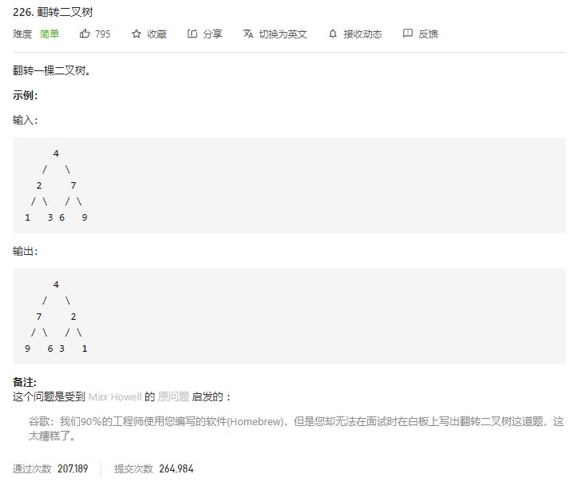

### leetcode_226_easy_翻转二叉树



```c++
class Solution {
public:
    TreeNode* invertTree(TreeNode* root) {

    }
};
```

#### 算法思路

递归地进行翻转

```c++
class Solution {
public:
    TreeNode* invertTree(TreeNode* root) {
        if(root!=nullptr)
        {
            root->left=invertTree(root->left);
            root->right=invertTree(root->right);
            swap(root->left,root->right);
        }
        return root;
    }
};
```

