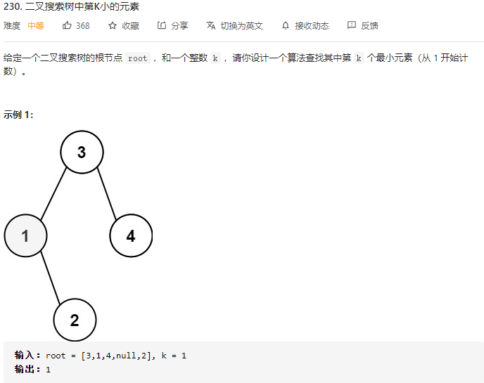
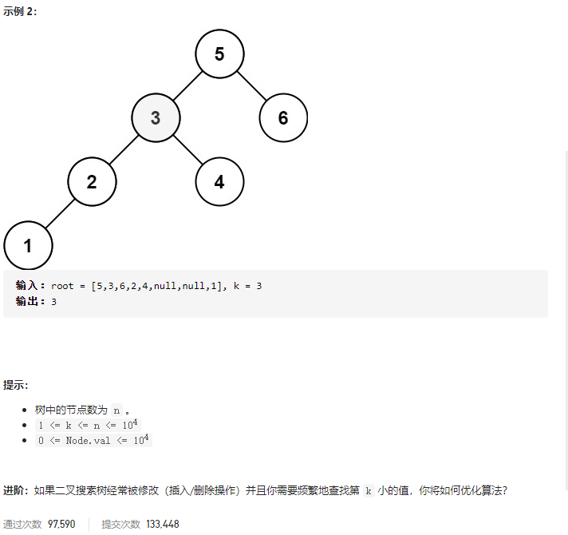

### leetcode_230_medium_二叉搜索树中第K小的元素





```c++
class Solution {
public:
    int kthSmallest(TreeNode* root, int k) {

    }
};
```

#### 算法思路

二叉搜索树的中序遍历，结果即一个升序序列。考察二叉搜索树的中序遍历

```c++
class Solution {
public:
    int kthSmallest(TreeNode* root, int k) {
        int index=0;
        TreeNode *curNode;
        stack<TreeNode*> nodes;

        curNode=root;
        while(curNode || !nodes.empty())
        {
            //根节点压栈，先处理左子树
            while(curNode)
            {
                nodes.push(curNode);
                curNode=curNode->left;
            }
            //弹栈，处理右子树
            if(!nodes.empty())
            {
                //访问
                curNode=nodes.top();
                nodes.pop();
                if(++index==k)
                    return curNode->val;
                //转到右子树
                curNode=curNode->right;
            }
        }
        return -1;
    }
};
```

