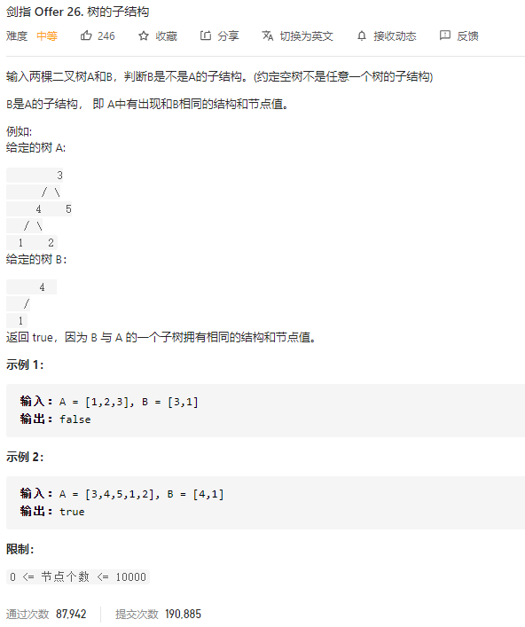

### 剑指offer_26_medium_树的子结构



```c++
class Solution {
public:
    bool isSubStructure(TreeNode* A, TreeNode* B) {

    }
};
```

#### 算法思路

另外定义一个函数，判断树B是否为树A剪枝得来的

```c++
class Solution {
public:
	bool isSubStructure(TreeNode* A, TreeNode* B) {
		if (A == nullptr || B == nullptr)
			return false;
		if (isSimiliar(A, B))
			return true;
		else
			return isSubStructure(A->left, B) || isSubStructure(A->right, B);
	}

	//B数是否是A树裁剪后的结果
	bool isSimiliar(TreeNode *A, TreeNode *B)
	{
		if (B == nullptr)
			return true;
		if (A == nullptr)
			return false;
		if (A->val != B->val)
			return false;
		return isSimiliar(A->left, B->left) && isSimiliar(A->right, B->right);
	}
};
```

