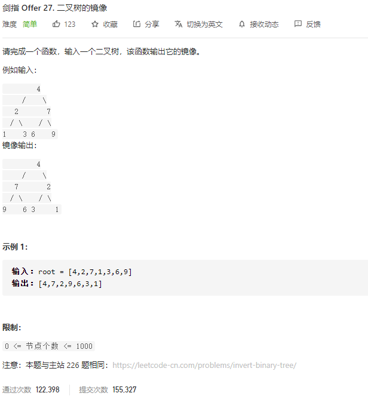

### 剑指offer_27_easy_二叉树的镜像



```c++
class Solution {
public:
    TreeNode* mirrorTree(TreeNode* root) {

    }
};
```

#### 算法思路

同 leetcode_226_easy_翻转二叉树

递归地翻转左右子树，然后连接到根节点上

```c++
class Solution {
public:
    TreeNode* mirrorTree(TreeNode* root) {
        TreeNode *newLeft,*newRight;
        if(root==nullptr)
            return nullptr;
        newLeft=mirrorTree(root->right);
        newRight=mirrorTree(root->left);
        root->left=newLeft;
        root->right=newRight;
        return root;
    }
};
```

