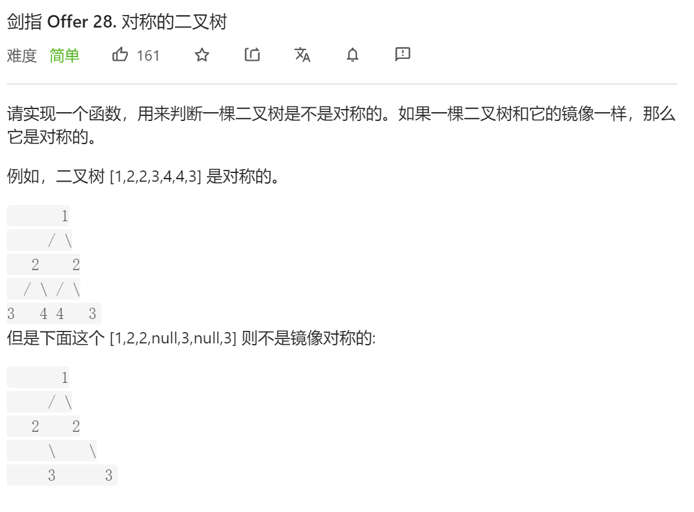
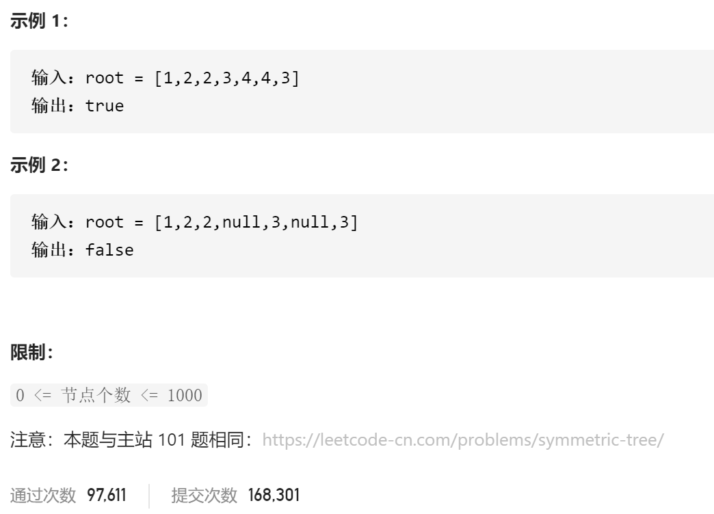

### 剑指offer_28_easy_对称的二叉树





```c++
class Solution {
public:
    bool isSymmetric(TreeNode* root) {

    }
};
```

#### 算法思路

同 leetcode_101_easy_对称二叉树

```c++
class Solution {
public:
    bool isSymmetric(TreeNode* root) {
        if(root==nullptr)
            return true;
        else
            return isSymmetric(root->left,root->right);
    }

    //判断两棵树是否对称
    bool isSymmetric(TreeNode *root1,TreeNode *root2)
    {
        if(root1==nullptr && root2==nullptr)
            return true;
        else if(root1==nullptr || root2==nullptr)
            return false;
        else if(root1->val!=root2->val)
            return false;
        return isSymmetric(root1->left,root2->right)
            &&isSymmetric(root1->right,root2->left);
    }
};
```

