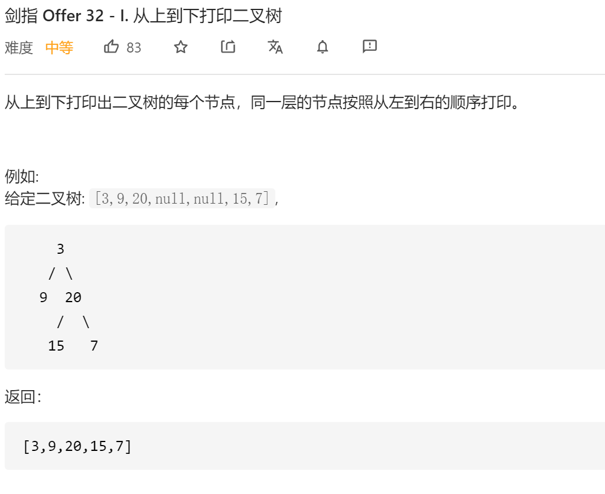
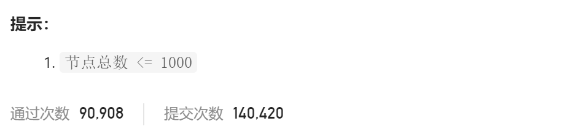

### 剑指offer_32.1_medium_从上到下打印





```c++
class Solution {
public:
    vector<int> levelOrder(TreeNode* root) {

    }
};
```

#### 算法思路

使用队列进行遍历

```c++
class Solution {
public:
    vector<int> levelOrder(TreeNode* root) {
        TreeNode *curNode;
        queue<TreeNode*> nodes;
        vector<int> result;

        if(root!=nullptr)
            nodes.push(root);
        while(!nodes.empty())
        {
            curNode=nodes.front();
            nodes.pop();     
            result.push_back(curNode->val);
            if(curNode->left)
                nodes.push(curNode->left);
            if(curNode->right)
                nodes.push(curNode->right);       
        }
        return result;
    }
};
```

