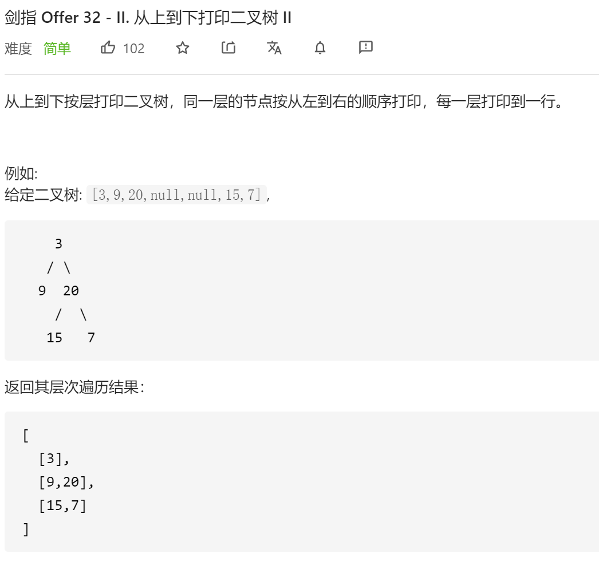
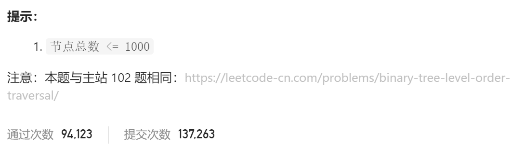

### 剑指offer_32.2_easy_从上到下打印二叉树 Ⅱ





```c++
class Solution {
public:
    vector<vector<int>> levelOrder(TreeNode* root) {

    }
};
```

#### 算法思路

类似二叉树的层次遍历

```c++
class Solution {
public:
    vector<vector<int>> levelOrder(TreeNode* root) {
        int curLineLength=0;  //当前行剩余节点数
        int nxtLineLength=0;  //下一行剩余节点数
        TreeNode *curNode;
        queue<TreeNode*> nodes;
        vector<int> curLineData;
        vector<vector<int>> result;

        if(root!=nullptr)
        {
            curLineLength=1;
            nodes.push(root);
        }
        while(!nodes.empty())
        {
            --curLineLength;
            curNode=nodes.front();
            nodes.pop();
            curLineData.push_back(curNode->val);
            if(curNode->left)
            {
                ++nxtLineLength;
                nodes.push(curNode->left);
            }
            if(curNode->right)
            {
                ++nxtLineLength;
                nodes.push(curNode->right);
            }
            if(curLineLength==0)
            {
                curLineLength=nxtLineLength;
                nxtLineLength=0;
                result.push_back(curLineData);
                curLineData.clear();
            }
        }
        return result;
    }
};
```

