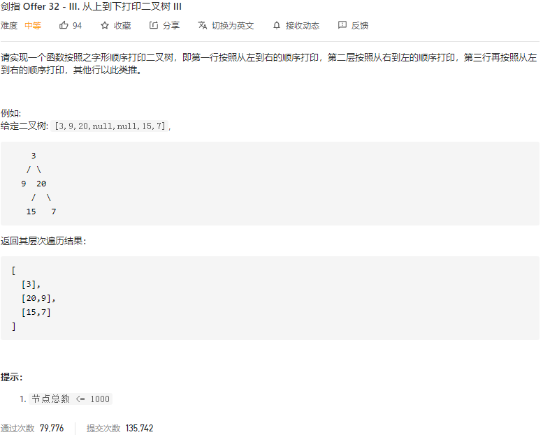

### 剑指offer_32.3_medium_从上到下打印二叉树 Ⅲ



```c++
class Solution {
public:
    vector<vector<int>> levelOrder(TreeNode* root) {

    }
};
```

#### 算法思路

在 剑指offer_32.2_easy_从上到下打印二叉树 Ⅱ 的基础上，对奇数行进行翻转

```c++
class Solution {
public:
    vector<vector<int>> levelOrder(TreeNode* root) {
        bool odd;  //指示当前行是否为奇数行(下标从0开始)
        int curLineLength=0;  //当前行剩余节点数
        int nxtLineLength=0;  //下一行剩余节点数
        TreeNode *curNode;
        queue<TreeNode*> nodes;
        vector<int> curLineData;
        vector<vector<int>> result;

        if(root!=nullptr)
        {
            curLineLength=1;
            nodes.push(root);
        }
        odd=false;
        while(!nodes.empty())
        {
            --curLineLength;
            curNode=nodes.front();
            nodes.pop();
            curLineData.push_back(curNode->val);
            if(curNode->left)
            {
                ++nxtLineLength;
                nodes.push(curNode->left);
            }
            if(curNode->right)
            {
                ++nxtLineLength;
                nodes.push(curNode->right);
            }
            if(curLineLength==0)
            {
                curLineLength=nxtLineLength;
                nxtLineLength=0;
                if(odd)
                    reverse(curLineData.begin(),curLineData.end());
                result.push_back(curLineData);
                curLineData.clear();
                odd=!odd;
            }
        }
        return result;
    }
};
```

