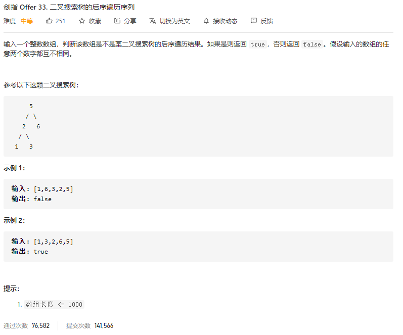

### 剑指offer_33_medium_二叉搜索树的后续遍历序列



```c++
class Solution {
public:
    bool verifyPostorder(vector<int>& postorder) {

    }
};
```

#### 算法思路

递归地处理。

一棵树是二叉搜索树，需满足

- 左子树是二叉搜索树
- 右子树是二叉搜索树
- 左子树的最大值<根节点值
- 右子树的最小值>根节点值

```c++
class Solution {
public:
	bool verifyPostorder(vector<int>& postorder) {
		int minimum = 0, maximum = 0;

        if(postorder.empty())
            return true;
		return verifySubtree(postorder, 0, postorder.size() - 1, minimum, maximum);
	}

	//判断[left,right]闭区间的子树，是否为二叉搜索树。通过引用返回该子树的最小值与最大值
	//该函数处理的子树，长度至少为1
	bool verifySubtree(vector<int> &postorder, int left, int right, int &minimum, int &maximum)
	{
		int max1 = INT_MIN, min2 = INT_MAX;  //初值的设定，使得在缺省情况下  不会判断为假
		int divide;  //下标为divide及更右边的 均为右子树
		if (left == right)  //长度仅有1的特殊情况
		{
			minimum = postorder[left];
			maximum = postorder[left];
			return true;
		}

		//查找两个数组的分界线
		divide = left;
		while (divide < right && postorder[divide] < postorder[right])
			++divide;
		//分别判断两个子数组是否合法
		if (divide > left)  //左子树非空
		{
			if (!verifySubtree(postorder, left, divide - 1, minimum, max1))  //左子树非法，则当前树非法
				return false;
		}
		else
			minimum = postorder[right];
		if (divide < right)  //右子树非空
		{
			if (!verifySubtree(postorder, divide, right - 1, min2, maximum))  //右子树非法，则当前树非法
				return false;
		}
		else
			maximum = postorder[right];
		//判断整棵树是否符合二叉搜索
		return max1 <= postorder[right] && postorder[right] <= min2;
	}
};

```

