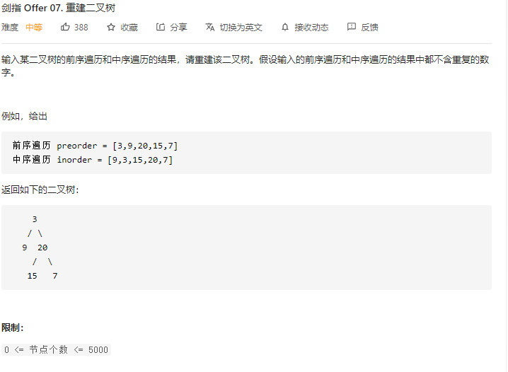

### 剑指offer_7_medium_重建二叉树



```c++
class Solution {
public:
    TreeNode* buildTree(vector<int>& preorder, vector<int>& inorder) {

    }
};
```

#### 算法思路

同 leetcode_105_medium_从前序与中序遍历序列构造二叉树.md

```c++
class Solution {
public:
    TreeNode* buildTree(vector<int>& preorder, vector<int>& inorder) {
        return buildTree(preorder,0,preorder.size()-1,inorder,0,preorder.size()-1);
    }

    //使用给定范围的数据，重建二叉树
    TreeNode* buildTree(vector<int> &preorder,int preLeft,int preRight,vector<int> &inorder,int inLeft,int inRight)
    {
        int midPos=-1;  //当前子树的根节点，在inOrder中的下标
        TreeNode *result;

        if(preLeft>preRight)
            return nullptr;
        /*else if(preLeft==preRight)
            return new TreeNode(preorder[preLeft]);
        */

        //构造当前子树的根节点
        result=new TreeNode(preorder[preLeft]);
        //在中序遍历数组中，查找根节点的位置
        for(int i=inLeft;i<=inRight;i++)
        {
            if(inorder[i]==preorder[preLeft])
            {
                midPos=i;
                break;
            }
        }
        //递归地构建左右子树
        result->left=buildTree(preorder,preLeft+1,preLeft-inLeft+midPos,inorder,inLeft,midPos-1);
        result->right=buildTree(preorder,preRight+midPos+1-inRight,preRight,inorder,midPos+1,inRight);

        return result;
    }
};
```

