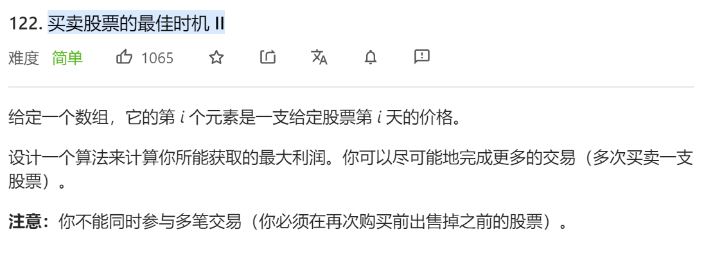
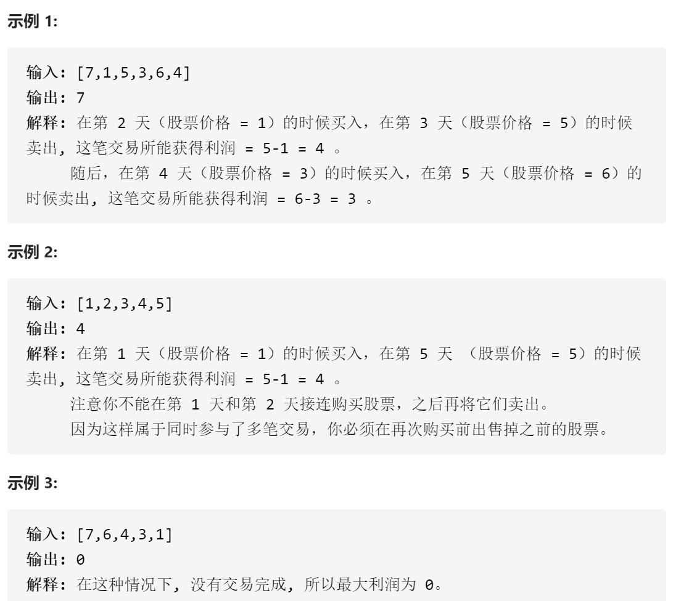
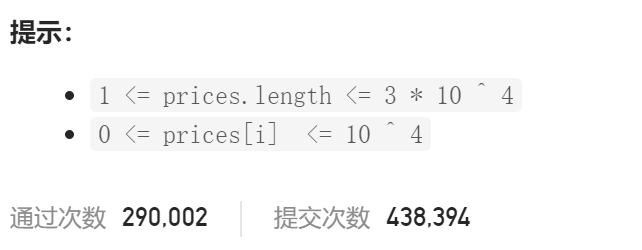

### leetcode_122_easy_买卖股票的最佳时机 II







```c++
class Solution {
public:
	int maxProfit(vector<int>& prices) {
		int i, result;

		result = 0;
		for (i = 1; i < prices.size(); i++)
		{
			if (prices[i] > prices[i - 1])
				result += prices[i] - prices[i - 1];
		}
		return result;
	}
};
```

#### 算法思路

**贪心**算法。本质上 就是要抓住每一个**上升区间**。如果股票在某天内是升值的，那么这段时间应该要持有股票。

```c++
class Solution {
public:
	int maxProfit(vector<int>& prices) {
		int i, result;

		result = 0;
		for (i = 1; i < prices.size(); i++)
		{
			if (prices[i] > prices[i - 1])
				result += prices[i] - prices[i - 1];
		}
		return result;
	}
};
```

