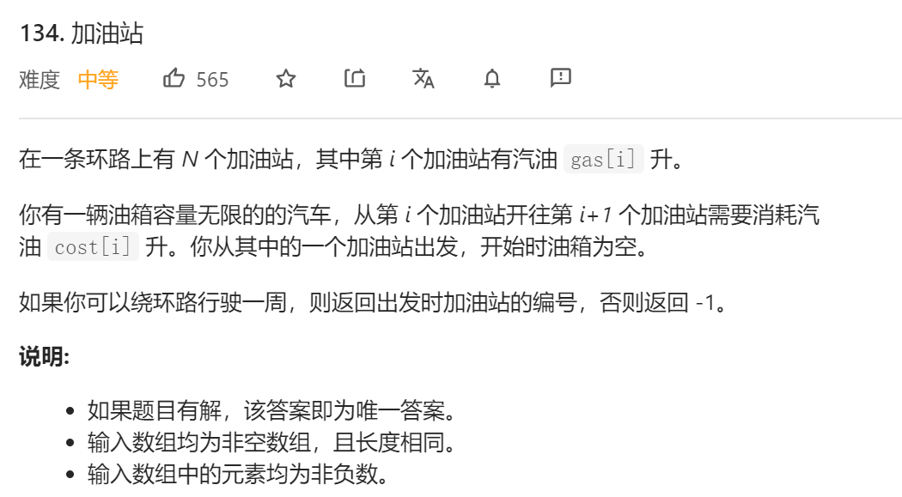
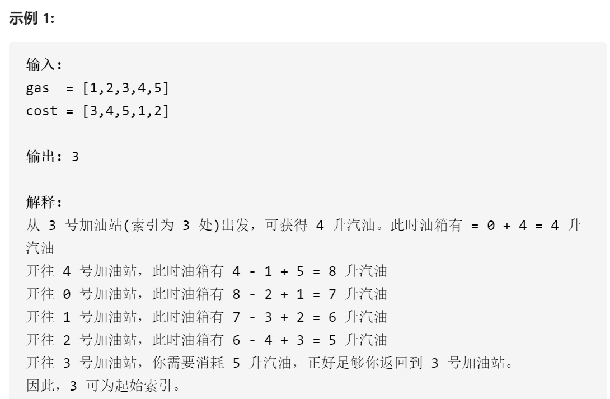
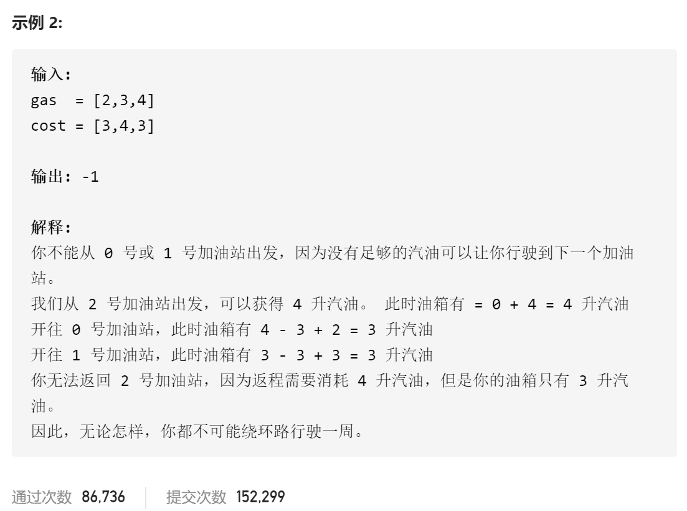

### leetcode_134_medium_加油站







```c++
class Solution {
public:
    int canCompleteCircuit(vector<int>& gas, vector<int>& cost) {

    }
};
```

#### 算法思路

简化理解题目。每当到达一个加油站时，总要出发前往下个加油站。也就意味着，需要先加油gas[i]，再消耗燃油cost[i]，也就是，**燃油量变化量gasChange[i]=gas[i]-cost[i]**。如果经过某加油站后，燃油量变为0以下了，则意味着无法前进。

 不妨先假设汽车从第0个加油站出发。sum[i]记录汽车在第n个加油站的燃油总量。sum[0]=gasChange[0]，sum[1]=sum[0]+gasChange[1]以此类推。则，

- 即使存在某种绕环路一周的方式，sum[]中也可能出现负值
- 如果sum[]的最后一个元素为负值，这意味着总的燃油变化量为负值，不可能绕一周
- 如果sum[]的最后一个元素为非负值，则可能存在一个合法的出发地点。不妨设sum[]在sum[minPos]处取得最小值，则，应从k+1处出发。
  1. 从minPos+1处出发，一直行驶到size-1处，即末尾处。由于sum[minPos]为最小值，所以，在以上任一位置，燃油量sum[i]-sum[minPos]>0，即燃油总是大于0的
  2. 从0处，行驶到minPos处。燃油量的最小值，一定是在minPos处。由于sum[]的最后一个元素为非负值，所以，行驶一圈回到sum处时，燃油量就是这个非负值。即可以行驶到minPos处

```c++
class Solution {
public:
	int canCompleteCircuit(vector<int>& gas, vector<int>& cost) {
		int i,minPos,minimum,size = gas.size();
		vector<int> gasChange(size);  //从各个加油站 出发+行驶到下个加油站，燃油变化量
		vector<int> sum(size);
		
		for (i = 0; i < size; i++)
			gasChange[i] = gas[i] - cost[i];
		//从0出发的情况
		minPos = 0;
		sum[0] = gasChange[0];
		minimum = sum[0];
		for (i = 1; i < size; i++)
		{
			sum[i] = sum[i - 1] + gasChange[i];
			if (sum[i] < minimum)
			{
				minPos = i;
				minimum = sum[i];
			}
		}
		//讨论出发位置
		if (sum[size - 1] < 0)
			return -1;
		else
			return (minPos + 1) % size;
	}
};
```

