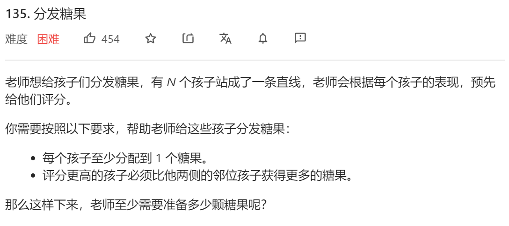
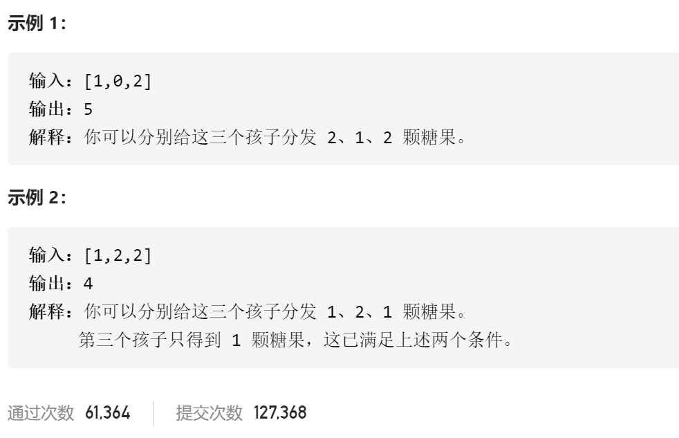
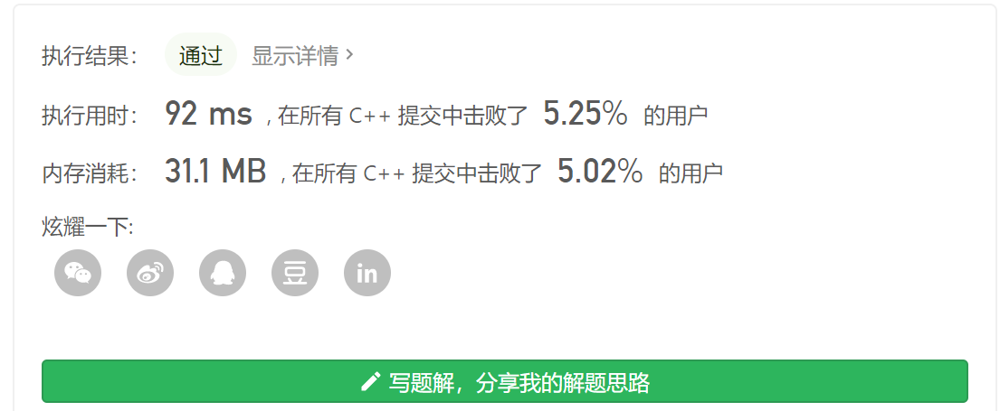

### leetcode_135_hard_分发糖果





```c++
class Solution {
public:
    int candy(vector<int>& ratings) {

    }
};
```


#### 算法思路

分糖果的时候，要保证，如果孩子评分高于两侧临位的话，就要得到比他们更多的糖果。那么，先给评分低的孩子，分尽可能少的糖果。

如何做到先给评分低的孩子分配糖果呢？用ordered_map存储 评分->孩子位置 的映射

```c++
class Solution {
public:
	int candy(vector<int>& ratings) {
		int i, pos, result,childNum=ratings.size();
		vector<int> candy(childNum, 1);
		map<int, vector<int>> childPos;  // 从评分到该评分孩子位置 的映射
		map<int, vector<int>>::iterator iter;

		//存储各个评分孩子的位置
		for (i = 0; i < childNum; i++)
			childPos[ratings[i]].push_back(i);
		//为各个评分的孩子分配糖果
		for (iter = childPos.begin(); iter != childPos.end(); iter++)
		{
			for (i = 0; i < iter->second.size(); i++)
			{
				pos = iter->second[i];
				if (pos > 0 && ratings[pos] > ratings[pos - 1])
					candy[pos] = max(candy[pos], candy[pos - 1] + 1);
				if (pos<childNum - 1 && ratings[pos]>ratings[pos + 1])
					candy[pos] = max(candy[pos], candy[pos + 1] + 1);
			}
		}
		//统计糖果总量
		result = 0;
		for (i = 0; i < childNum; i++)
			result += candy[i];
		return result;
	}
};
```

