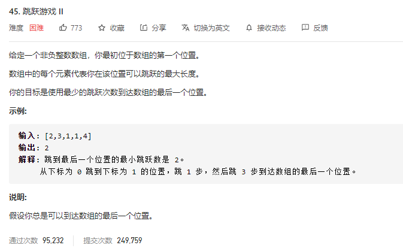
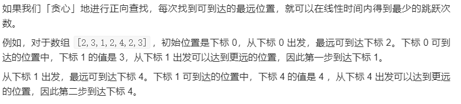

### leetcode_45_hard_跳跃游戏



```c++
class Solution {
public:
    int jump(vector<int>& nums) {

    }
};
```

#### dp算法

构造一个step数组，step[i]代表到达第i个位置所需的步数。

当讨论第i个元素时，step[i]已经确定。则从第i个元素出发，可以以step[i]+1的步数，到达第[i+1,i+nums[i]]区间内的元素。更新这个区间内的元素的步数。

这种算法，讨论每个位置，且讨论从每个位置出发的各种步长。时间复杂度O(n^2)，无法通过

```c++
class Solution {
public:
	int jump(vector<int>& nums) {
		int i, j, size = nums.size();
		vector<int> step(size, INT_MAX);  //到达各个位置所需的步数
		
		if (nums.empty())
			return 0;
		step[0] = 0;
		for (i = 0; i < size; i++)  //更新从i出发的，一步可达的各节点
		{
			for (j = i + 1; j <= min(size - 1, i + nums[i]); j++)
			{
				step[j] = min(step[j], step[i] + 1);
			}
		}
		return step[size - 1];
	}
};
```


#### 贪心算法

在dp算法的基础上进行改进。

当讨论目前在下标i位置时，固然可以再走一步，到达[i+1,i+nums[i]]区间内的任意位置。但是，最好是走到这么一个j位置，使得从j位置开始走一步可到达的里程最长。




做法是，每当走到了下标为i的节点，讨论[i,i+nums[i]]这个区间内，哪个节点可以走得最远。下次即走到这个节点

```c++
class Solution {
public:
	int jump(vector<int>& nums) {
		int i, j, nextStep,maxRange;
		int step = 0,size=nums.size();

		if (nums.size()<=1)  //这是用来处理i刚好已经在末尾的特殊情况
			return 0;
		i = 0;
		while (i < size)
		{
			if (i + nums[i] >= size - 1)  //如果能从i直接走到末尾
				return step + 1;
			nextStep = i;  //记录下一步将要走上的位置
			maxRange = i;  //从[i+1,i+nums[i]]这个区间内的任意节点，走一步可以到达的最远距离
			for (j = i+1; j <= i + nums[i]; j++)
			{
				if (j + nums[j] > maxRange)  //从j这个节点出发可以走得更远，j是一个更有潜力的候选点
				{
					maxRange = j + nums[j];
					nextStep = j;
				}
			}
			i = nextStep;
			step++;
		}
		return -1;
	}
};
```

