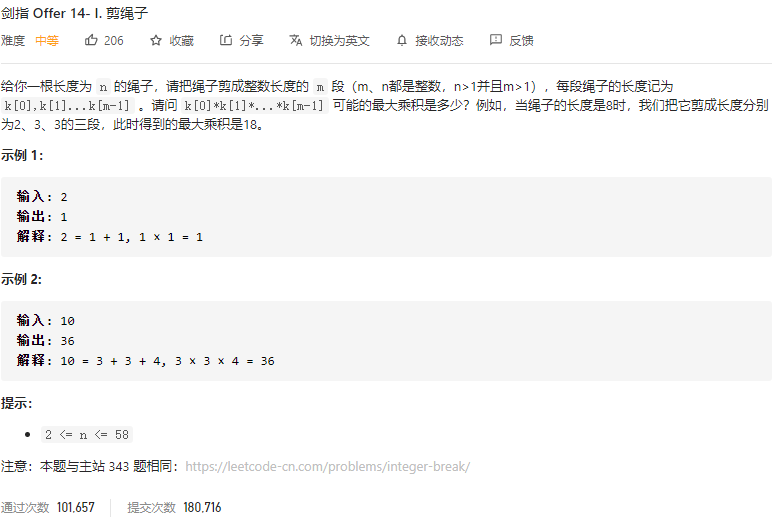

### 剑指offer_14.1_medium_割绳子



```c++
class Solution {
public:
    int cuttingRope(int n) {

    }
};
```

#### 算法思路

动态规划，dp[i]表示长度为i的绳子可以剪出的最大乘积。

关键是状态转移方程。要考虑减去多长的一段绳子

4=2*2。所以剪下一段长度为4的绳子，等价于剪下两段长度为2的绳子

5<2*3。所以剪下一段长度为5的绳子，差于剪下两段长度为2的绳子

由上可得，最优的剪绳子策略，即只考虑裁剪出长度为2或3的绳子。


在动态规划的基础上进一步优化

 2 * 2 * 2 < 3 * 3，所以，应该尽可能裁剪长度为3的绳子，剩下的再裁剪为长度为2的绳子

```c++
class Solution {
public:
    int cuttingRope(int n) {
        int result=1;

        //无法裁减为3或2的若干特殊情况
        if(n==2)
            return 1;
        else if(n==3)
            return 2;
        //裁剪出若干长度为2的绳子
        if(n%3==1)  //需要裁减两段长度为2的绳子
        {
            n-=4;
            result*=4;
        }
        else if(n%3==2)  //需要裁减一段长度为2的绳子
        {
            n-=2;
            result*=2;
        }
        //裁剪出若干长度为3的绳子
        result*=pow(3,n/3);

        return result;
    }
};
```

