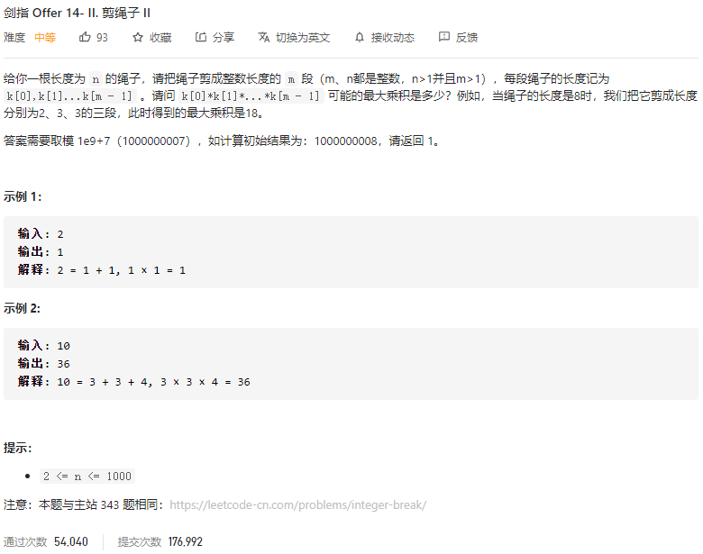

### 剑指offer_14.2_medium_割绳子



```c++
class Solution {
public:
    int cuttingRope(int n) {

    }
};
```

#### 算法思路

同 剑指offer_14.1_medium_割绳子

注意求模。用long 避免溢出

```c++
class Solution {
public:
	int cuttingRope(int n) {
		long result = 1;

		//无法裁减为3或2的若干特殊情况
		if (n == 2)
			return 1;
		else if (n == 3)
			return 2;
		//裁剪出若干长度为2的绳子
		if (n % 3 == 1)  //需要裁减两段长度为2的绳子
		{
			n -= 4;
			result *= 4;
		}
		else if (n % 3 == 2)  //需要裁减一段长度为2的绳子
		{
			n -= 2;
			result *= 2;
		}
		//裁剪出若干长度为3的绳子
		//result*=pow(3,n/3);
		while (n > 0)
		{
			n -= 3;
			result *= 3;
			result = result % 1000000007;
		}
		return int(result);
	}
};
```

