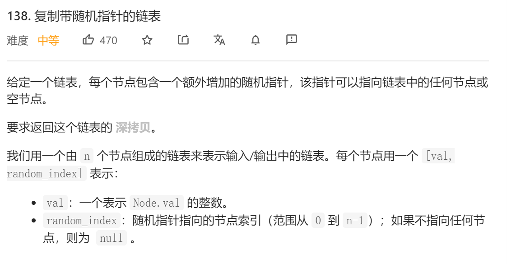
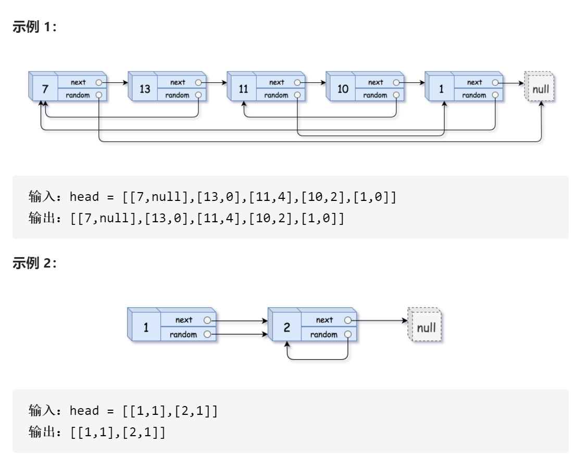
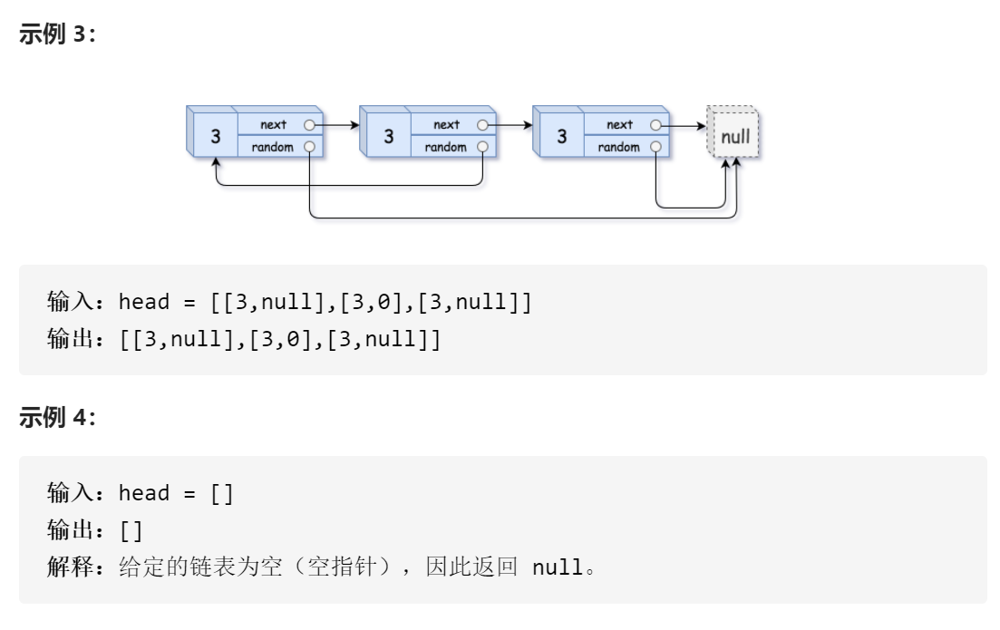
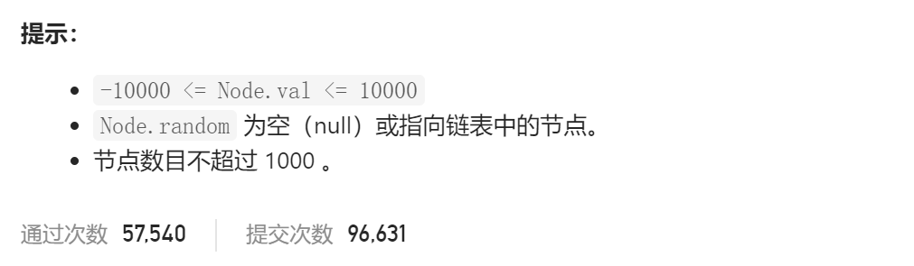

### leetcode_138_medium_复制带随机指针的链表









```c++
class Solution {
public:
    Node* copyRandomList(Node* head) {
        
    }
};
```

#### 算法思路

链表的深拷贝，很简单。算法首先要部分拷贝原链表，包括其节点和next指针

本题的考察点在于，random指针如何拷贝。当原链表节点的random指针，指向原链表的某个节点，那么，新链表节点的对应指针，也应指向新链表的对应节点。用一个hashmap维护这个对应关系即可。

```c++
class Solution {
public:
	Node* copyRandomList(Node* head) {
		Node *pSrc, *pDst,*pDummySrc,*pDummyDst;
		unordered_map<Node*, Node*> map;  //原链表节点到新链表对应节点的映射
		//拷贝链表的节点 next指针
		pDummySrc = new Node(0);
		pDummySrc->next = head;
		pDummyDst = new Node(0);
		pSrc = pDummySrc;
		pDst = pDummyDst;
		while (pSrc->next)
		{
			pDst->next = new Node(pSrc->next->val);
			pSrc = pSrc->next;
			pDst = pDst->next;
			map[pSrc] = pDst;
		}
		//拷贝random指针
		pSrc = pDummySrc->next;
		pDst = pDummyDst->next;
		map[nullptr] = nullptr;
		while (pSrc)
		{
			pDst->random = map[pSrc->random];
			pSrc = pSrc->next;
			pDst = pDst->next;
		}
		pDst = pDummyDst->next;
		delete pDummySrc;
		delete pDummyDst;
		return pDst;
	}
};
```

