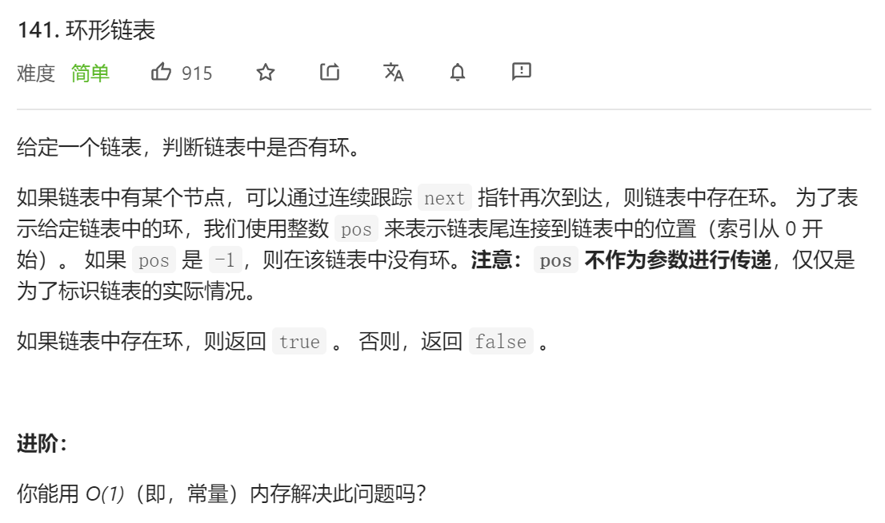
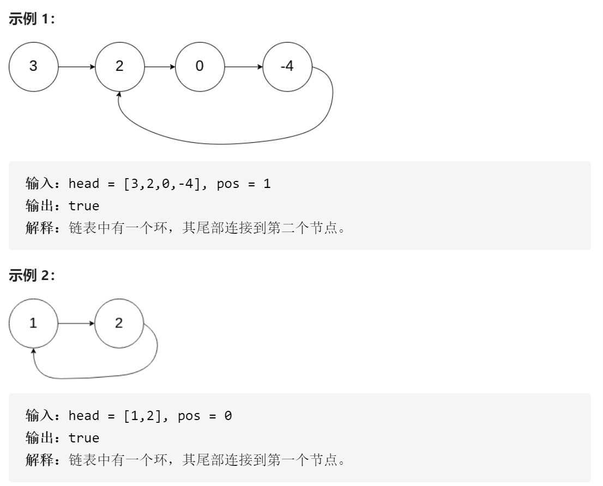
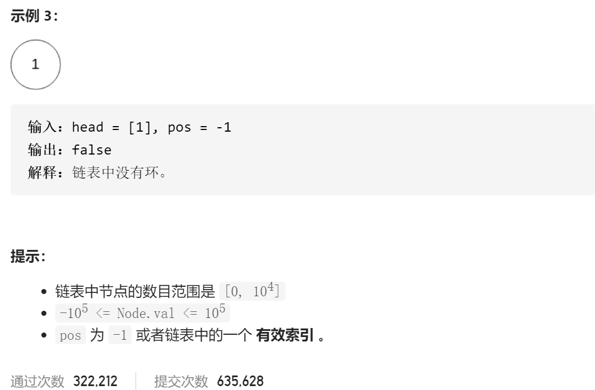

### leetcode_141_easy_环形链表







```c++
class Solution {
public:
    bool hasCycle(ListNode *head) {
        
    }
};
```

#### 算法思路

经典的快慢指针

```c++
class Solution {
public:
	bool hasCycle(ListNode *head) {
		ListNode *pSlow, *pFast;

		pSlow = head;
		pFast = head;
		if (!head)
			return false;
		while (pFast->next && pFast->next->next)
		{
			pSlow = pSlow->next;
			pFast = pFast->next->next;
			if (pSlow == pFast)
				return true;
		}
		return false;
	}
};
```

