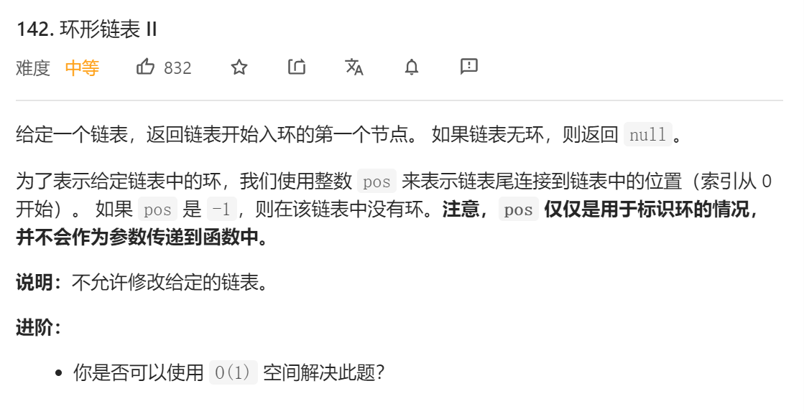
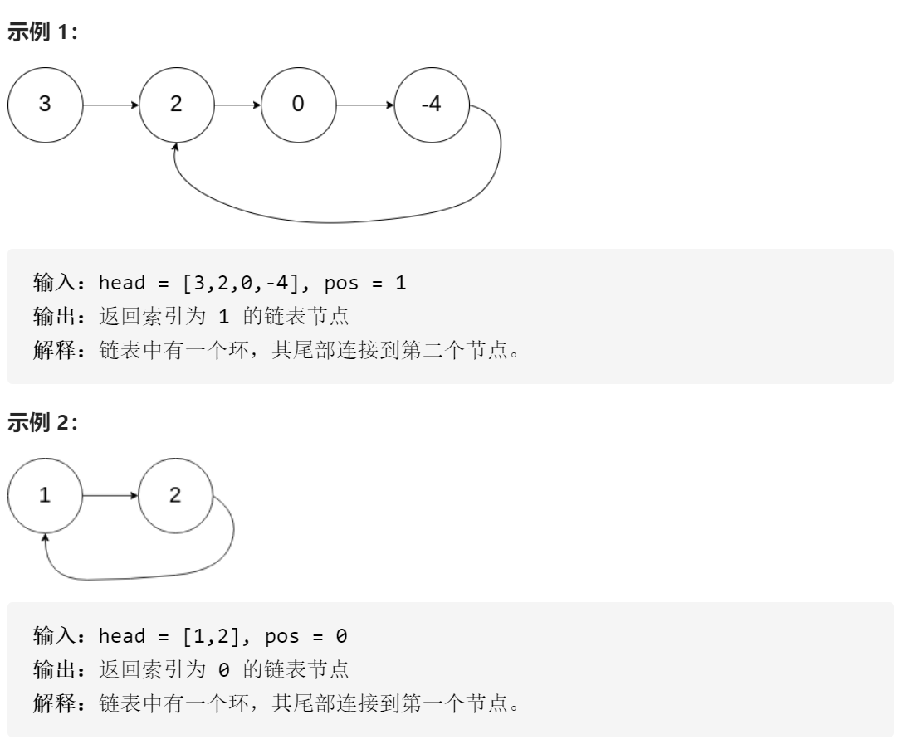
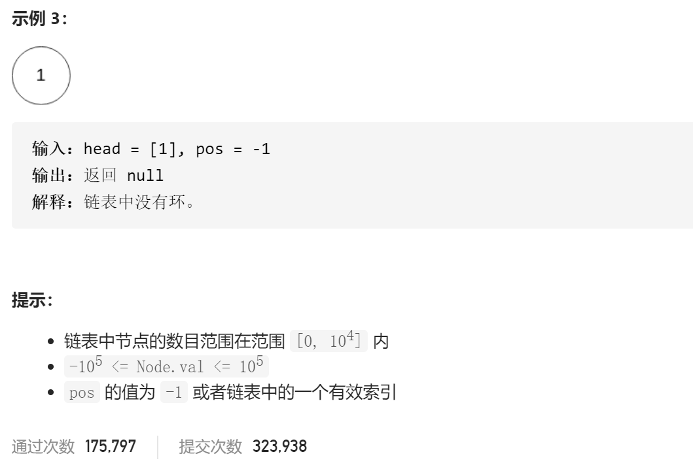

### leetcode_142_medium_环形链表 Ⅱ







#### 算法思路

仿照 leetcode_141_easy_环形链表 ，用快慢指针pSlow、pFast，一起访问链表。当他们相交时，意味着链表中有环。

讨论如何找到链表的起点


如上图所示，慢指针行走了环外的距离a，以及环内的距离b后，在紫色点与快指针相遇。

快指针的行走距离是慢指针的2倍。则

- 快指针比慢指针多走的路程，即为从紫色点出发，先走距离c，再走若干圈。
- 慢指针实际行走了的路程，是a+b

上述两段路程，距离相同。且其最后一小段距离b的路程，路径也是相同的。

所以，不妨令两个指针分别从起点，以及紫色点出发，以相同速度行走。当它们重合时，也就走到了最后一小段距离b的起点。也就是环的起点

```c++
class Solution {
public:
	ListNode *detectCycle(ListNode *head) {
		ListNode *pSlow, *pFast, *pIntersect, *pCur;

		pSlow = head;
		pFast = head;
		pIntersect = nullptr;
		//判断是否有环
		if (!head)
			return nullptr;
		while (pFast->next && pFast->next->next)
		{
			pSlow = pSlow->next;
			pFast = pFast->next->next;
			if (pSlow == pFast)
			{
				pIntersect = pSlow;
				break;
			}
		}
		if (!pIntersect)
			return nullptr;
		//寻找环的入口
		pCur = head;  //另一个节点，从头出发
		while (pCur != pSlow)
		{
			pCur = pCur->next;
			pSlow = pSlow->next;
		}
		return pCur;
	}
};
```

