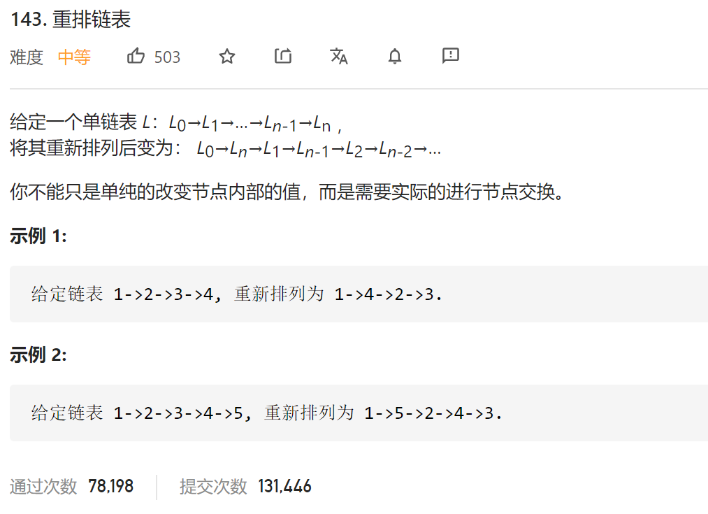
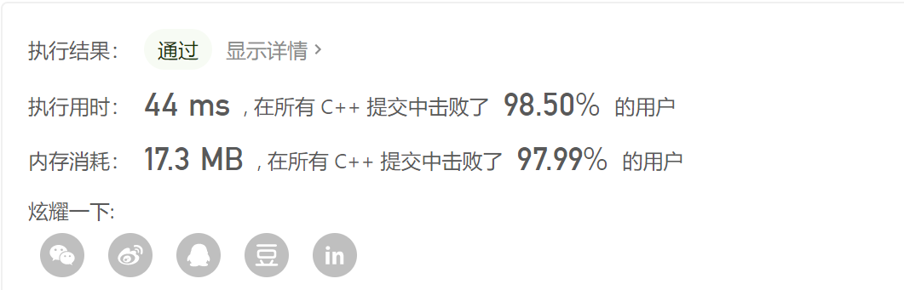

### leetcode_143_medium_重排链表



```c++
class Solution {
public:
    void reorderList(ListNode* head) {
        
    }
};
```

#### 翻转+合并

1. 找到后一半链表的起点
2. 翻转后一半链表
3. 合并两个链表

时间复杂度O(1)，空间复杂度O(1)

```c++
class Solution {
public:
	void reorderList(ListNode* head) {
		int length, halfLength;
		ListNode *pPart2, *pCur,*pCur1,*pCur2, *pPrev, *pNxt;

		//找到后一半链表的起始位置
		length = 0;
		pCur = head;
		while (pCur)
		{
			length++;
			pCur = pCur->next;
		}
		halfLength = int((length + 1) / 2);
		pPart2 = head;
		while (halfLength > 0)
		{
			halfLength--;
			pPart2 = pPart2->next;
		}
		//翻转后一半链表
		pPrev = nullptr;
		pCur = pPart2;
		while (pCur)
		{
			pNxt = pCur->next;
			pCur->next = pPrev;
			pPrev = pCur;
			pCur = pNxt;
		}
		pPart2 = pPrev;  //翻转后链表的头结点
		//合并两个链表
		pCur = new ListNode(-1);  //虚假的头结点，用于统一操作
		pCur1 = head;
		pCur2 = pPart2;
		while (pCur2)  //翻转链表更短，所以用它来判断是否到达终点
		{
			pCur->next = pCur1;
			pCur1 = pCur1->next;
			pCur = pCur->next;
			pCur->next = pCur2;
			pCur2 = pCur2->next;
			pCur = pCur->next;
		}
		if (length % 2)
		{
			pCur->next = pCur1;
			pCur = pCur->next;
		}
		pCur->next = nullptr;
	}
};
```



#### 线性表

另外使用一个vector，存储链表各个节点的指针。重拍链表。

时间复杂度O(1)，空间复杂度O(n)。代码略