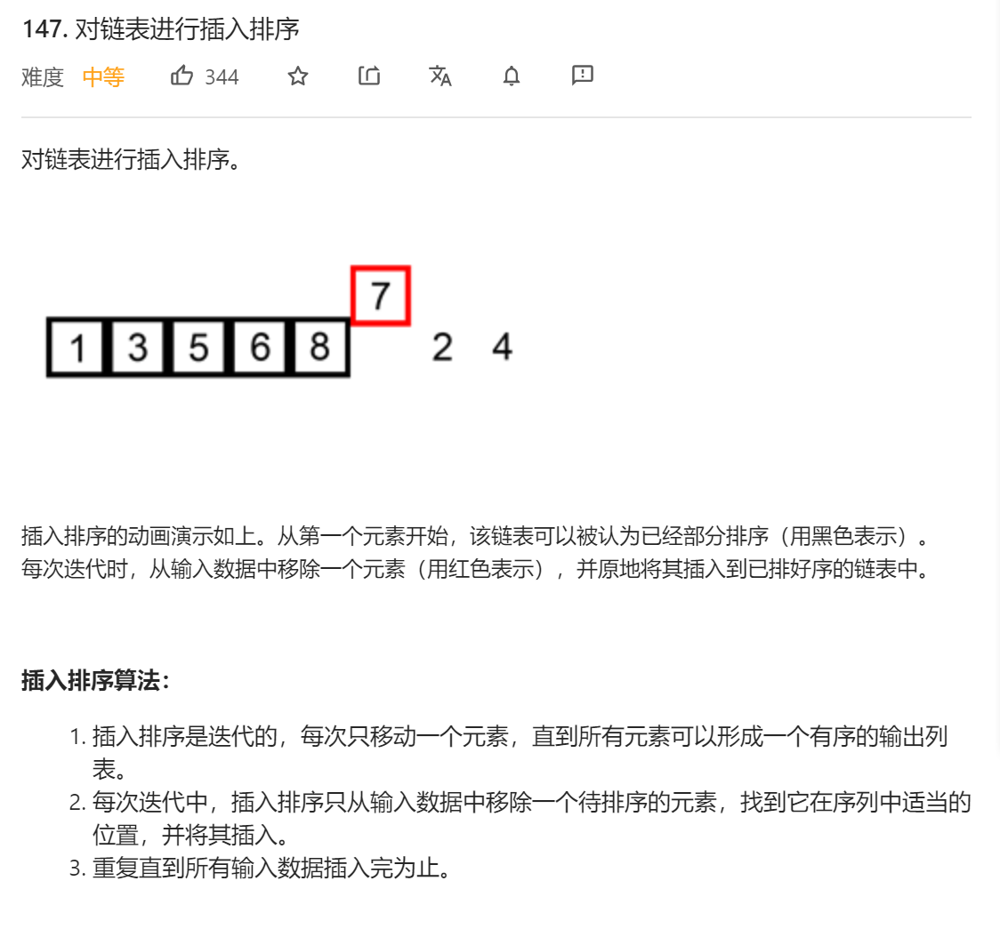
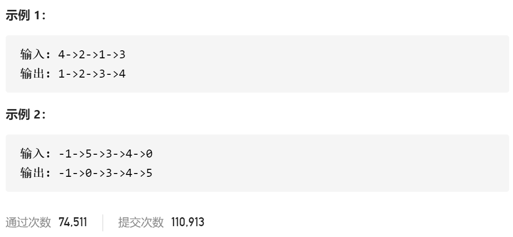

### leetcode_147_medium_对链表进行插入排序





```c++
class Solution {
public:
    ListNode* insertionSortList(ListNode* head) {

    }
};
```

#### 算法思路

```c++
class Solution {
public:
	ListNode* insertionSortList(ListNode* head) {
		ListNode *pEndOfOrder,*pCur,*pNode,*pDummyHead=new ListNode(INT_MIN,head);

		pEndOfOrder = head;  //有序数组的尾节点
		if (head == nullptr)
			return nullptr;
		while (pEndOfOrder->next)
		{
			pNode = pEndOfOrder->next;  //当前待处理的节点
			//移除该节点
			pEndOfOrder->next = pEndOfOrder->next->next;
			//插入到有序部分中
			pCur = pDummyHead;
			while (pCur!=pEndOfOrder && pNode->val > pCur->next->val)  //找到pCur的位置，使得pNode刚好可以插到pCur后面
				pCur = pCur->next;
			if (pCur == pEndOfOrder)
				pEndOfOrder = pNode;
			pNode->next = pCur->next;
			pCur->next = pNode;
		}
		head = pDummyHead->next;
		delete pDummyHead;
		return head;
	}
};
```

