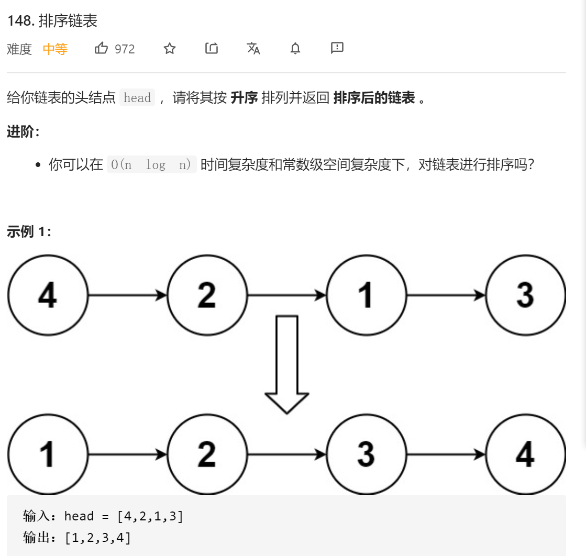
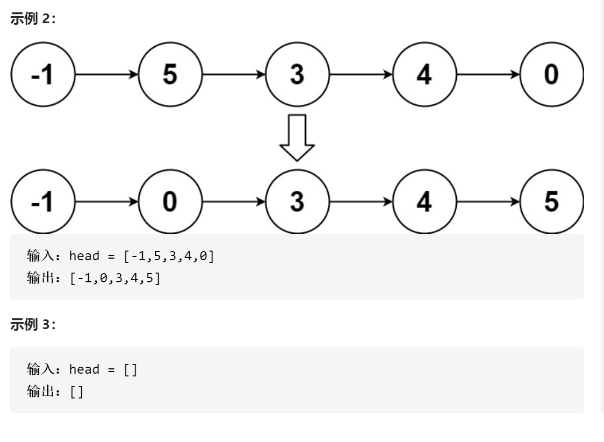
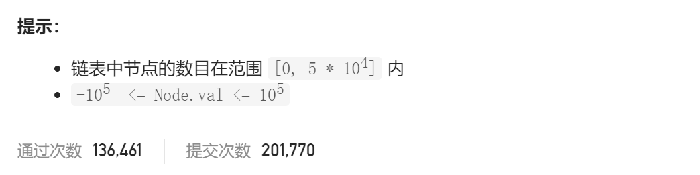

### leetcode_148_medium_排序链表







```c++
class Solution {
public:
    ListNode* sortList(ListNode* head) {

    }
};
```

#### 算法思路

归并排序

1. 拆分为两个链表
2. 对两个链表分别排序
3. 合并链表

```c++
class Solution {
public:
	ListNode* sortList(ListNode* head) {
		int length;
		ListNode *pCur, *pHead1, *pHead2;
		
		//统计链表长度
		pCur = head;
		length = 0;
		while (pCur)
		{
			length++;
			pCur = pCur->next;
		}
		if (length <= 1)
			return head;
		//拆分为两个链表 并分别排序
		length /= 2;
		length--;
		pCur = head;
		while (length > 0)  //此循环结束时，pCur指向前一半链表的尾节点
		{
			pCur = pCur->next;
			length--;
		}
		pHead2 = pCur->next;
		pCur->next = nullptr;
		pHead1 = sortList(head);
		pHead2 = sortList(pHead2);
		//合并链表
		return mergeTwoList(pHead1, pHead2);
	}

	ListNode* mergeTwoList(ListNode *head1, ListNode *head2)
	{
		ListNode *pCur,*pDummyHead = new ListNode(-1);

		pCur = pDummyHead;
		while (head1 && head2)
		{
			if (head1->val < head2->val)
			{
				pCur->next = head1;
				head1 = head1->next;
			}
			else
			{
				pCur->next = head2;
				head2 = head2->next;
			}
			pCur = pCur->next;
		}
		if (head1)
			pCur->next = head1;
		if (head2)
			pCur->next = head2;
		pCur = pDummyHead->next;
		delete pDummyHead;
		return pCur;
	}
};
```

