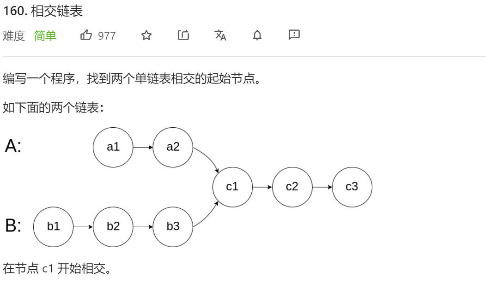
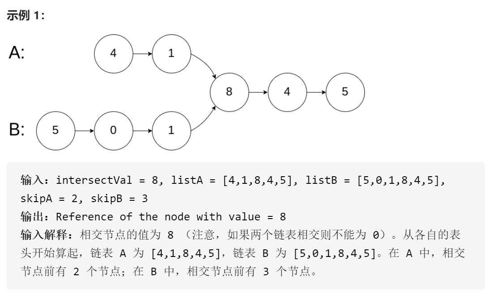
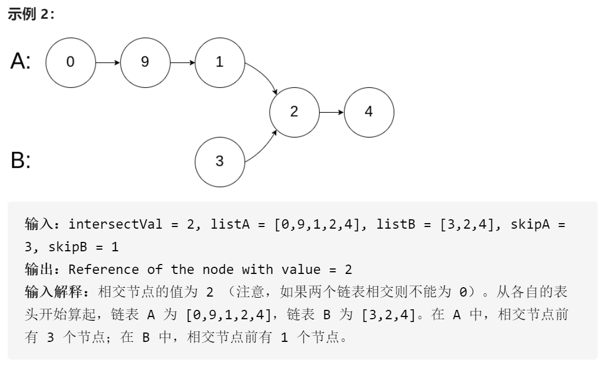
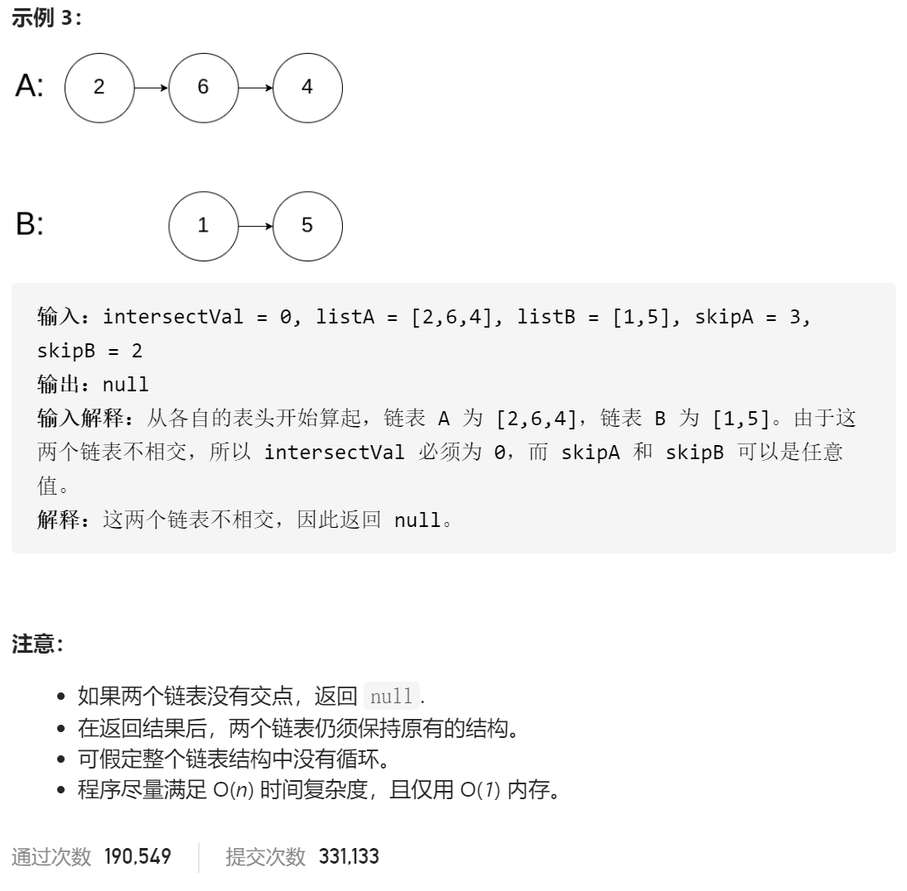

### leetcode_160_easy_相交链表









```c++
class Solution {
public:
    ListNode *getIntersectionNode(ListNode *headA, ListNode *headB) {
        
    }
};
```

#### 算法思路

第一趟扫描，计算两个链表的长度。

第二趟扫描，先移动长链表的指针，使得两个链表剩余长度相同。之后，两个链表指针同步移动 直到重合。

```c++
class Solution {
public:
	ListNode *getIntersectionNode(ListNode *headA, ListNode *headB) {
		int length1=0, length2=0;
		ListNode *p1=nullptr, *p2=nullptr;

		//统计链表长度
		p1 = headA;
		while (p1 != nullptr)
		{
			length1++;
			p1 = p1->next;
		}
		p2 = headB;
		while (p2 != nullptr)
		{
			length2++;
			p2 = p2->next;
		}
		//更新链表起点
		p1 = headA;
		p2 = headB;
		while (length1 > length2)
		{
			p1 = p1->next;
			length1--;
		}
		while (length2 > length1)
		{
			p2 = p2->next;
			length2--;
		}
		//同步移动，寻找交汇点
		while (p1 != p2)  //循环终止时 p1和p2要么指向同一个链表节点 要么都指向nullptr
		{
			p1 = p1->next;
			p2 = p2->next;
		}
		return p1;
	}
};
```

