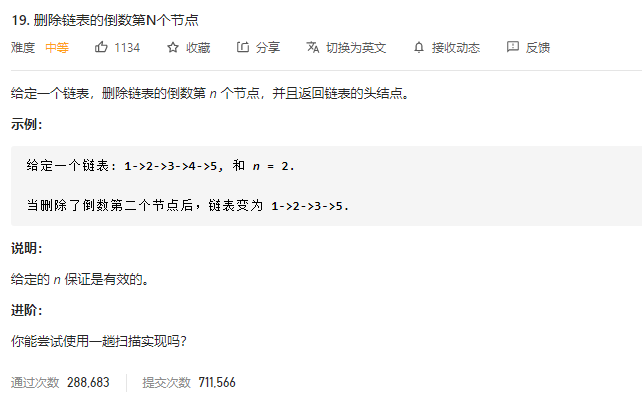

### leetcode_19_medium_删除链表的倒数第N个节点



```c++
/**
 * Definition for singly-linked list.
 * struct ListNode {
 *     int val;
 *     ListNode *next;
 *     ListNode() : val(0), next(nullptr) {}
 *     ListNode(int x) : val(x), next(nullptr) {}
 *     ListNode(int x, ListNode *next) : val(x), next(next) {}
 * };
 */
class Solution {
public:
    ListNode* removeNthFromEnd(ListNode* head, int n) {
        
    }
};
```

#### 扫描两次的算法

第一趟扫描，计算链表长度。

第二趟扫描，删除倒数第n个节点。链表的删除操作，即为将待删除节点的前直节点，其next指向待删除节点的后置节点。

注意**单独讨论删除头结点的情况**

```c++
class Solution {
public:
	ListNode* removeNthFromEnd(ListNode* head, int n) {
		int length,target,index;
		ListNode* pCur;

		//第一遍扫描，计算链表长度
		length = 0;
		pCur = head;
		while (pCur)
		{
			length++;
			pCur = pCur->next;
		}
		//第二遍扫描，删除对应节点
		index = 0;
		pCur = head;
		target = length - n - 1;  //待删除节点的前一个节点下标
		if (target == -1)  //删除头结点的情况
			return head->next;
		while (index != target)  //寻找待删除节点的前一个节点
		{
			index++;
			pCur = pCur->next;
		}
		pCur->next = pCur->next->next;

		return head;
	}
};
```

#### 扫描一次的算法

使用快慢指针。快指针先走n步，然后快慢指针一起前进。当pFast->next==nullptr的时候，pSlow指向待删除节点的前驱节点。

注意，仍需**单独讨论删除头结点的情况**

```c++
class Solution {
public:
	ListNode* removeNthFromEnd(ListNode* head, int n) {
		ListNode* pSlow = head, *pFast = head;
		
		//快指针先走n步
		while (n > 0)
		{
			pFast = pFast->next;
			n--;
		}
		//寻找并删除节点
		if (!pFast)  //快指针为空，意味着待删除节点是头结点
			return head->next;
		while (pFast->next)  //令pSlow指向待删除节点的前驱节点
		{
			pFast = pFast->next;
			pSlow = pSlow->next;
		}
		pSlow->next = pSlow->next->next;
		return head;
	}
};
```

