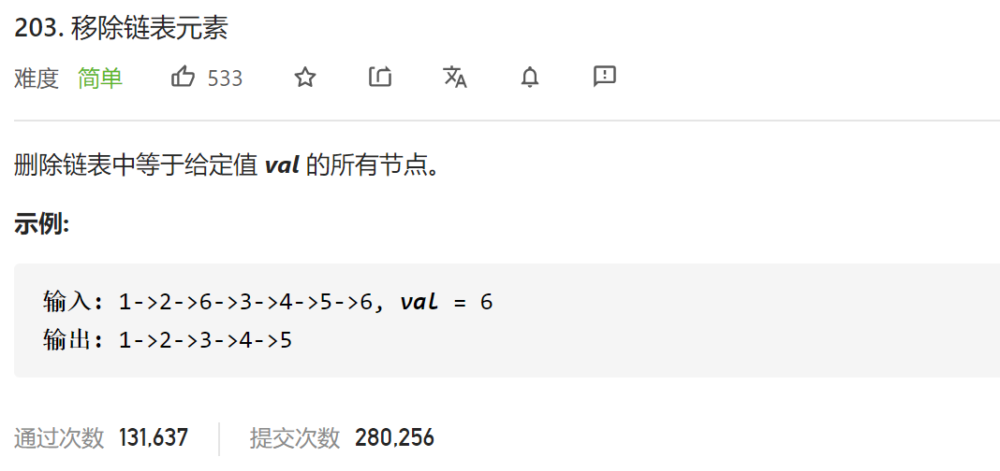

### leetcode_203_easy_移除链表元素



```c++
class Solution {
public:
    ListNode* removeElements(ListNode* head, int val) {

    }
};
```

#### 分别讨论

移除链表元素。

对于链表头的 值为val的元素，和链表当中的 值为val的元素 分别操作。

```c++
class Solution {
public:
	ListNode* removeElements(ListNode* head, int val) {
		ListNode* cur;
		//移除链表头值为val的元素
		while (head && head->val == val)
			head = head->next;
		if (!head)
			return nullptr;
		//移除链表当中值为val的元素
		cur = head;
		while (cur)
		{
			while (cur->next && cur->next->val==val)
			{
				cur->next = cur->next->next;  //从链表中移除下一个元素
			}
			cur = cur->next;
		}
		return head;
	}
};
```

#### 哨兵节点

设置哨兵节点 ListNode* sentinel 作为头结点的前驱节点，从而统一删除操作。代码略