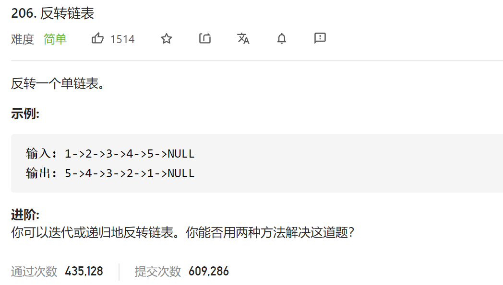

### leetcode_206_easy_反转链表



```c++
class Solution {
public:
    ListNode* reverseList(ListNode* head) {

    }
};
```

#### 迭代法

使用指针，迭代处理各个位置，即 翻转链表 的简单情况

```c++
class Solution {
public:
	ListNode* reverseList(ListNode* head) {
		ListNode *prev, *cur, *nxt;

		prev = nullptr;
		cur = head;
		while (cur)
		{
			nxt = cur->next;
			cur->next = prev;
			prev = cur;
			cur = nxt;
		}
		return prev;
	}
};
```

#### 递归法

翻转链表，即，先翻头结点之后的所有节点，再把原来的头结点，加到新链表的尾部

```c++
class Solution {
public:
	//翻转链表，返回新链表的头结点
	ListNode* reverseList(ListNode* head) {
		ListNode *newHead,*part;

		if (head==nullptr)  //空链表无需翻转
			return nullptr;
		if (head->next == nullptr)  //长度为1的链表无需翻转
			return head;
		part = head->next;  //链表 头结点以后的部分
		newHead = reverseList(head->next);  //翻转上述部分链表
		part->next = head;
		head->next = nullptr;

		return newHead;		
	}
};
```

