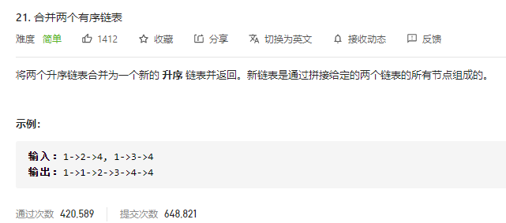

### leetcode_21_medium_合并两个有序链表



```c++
/**
 * Definition for singly-linked list.
 * struct ListNode {
 *     int val;
 *     ListNode *next;
 *     ListNode() : val(0), next(nullptr) {}
 *     ListNode(int x) : val(x), next(nullptr) {}
 *     ListNode(int x, ListNode *next) : val(x), next(next) {}
 * };
 */
class Solution {
public:
    ListNode* mergeTwoLists(ListNode* l1, ListNode* l2) {
        
    }
};
```

#### 算法思路

新建一个结果链表，取两个链表当中头结点较小的，加入结果链表集合

##### 头结点的前驱节点

可以另外设置一个头结点的前驱结点ListNode* preHead，从而方便迭代过程。这也是链表题目的常用技巧

```c++
class Solution {
public:
	ListNode* mergeTwoLists(ListNode* l1, ListNode* l2) {
		ListNode* preHead = new ListNode(-1);  //结果头结点的前驱节点
		ListNode* pCur = preHead;
		
		while (l1&&l2)
		{
			if (l1->val <= l2->val)
			{
				pCur->next = l1;
				pCur = l1;
				l1 = l1->next;
			}
			else
			{
				pCur->next = l2;
				pCur = l2;
				l2 = l2->next;
			}
		}

		//l1或者l2 可能还未被合并完。  直接将链表末尾指向未合并完的链表即可
		if (l1)
			pCur->next = l1;
		if (l2)
			pCur->next = l2;
		return preHead->next;
	}
};
```

