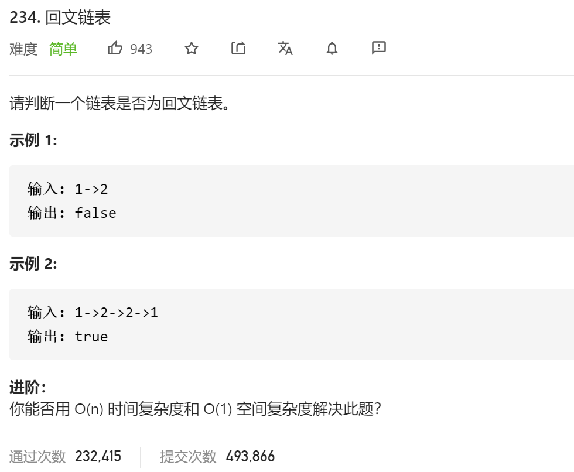

### leetcode_234_easy_回文链表



```c++
class Solution {
public:
    bool isPalindrome(ListNode* head) {

    }
};
```

#### 算法思路

见代码

```c++
class Solution {
public:
	//翻转链表，并返回翻转后的头结点
	ListNode* reverse(ListNode* head)
	{
		ListNode *pre, *cur, *nxt;
		pre = nullptr;
		cur = head;
		while (cur)
		{
			nxt = cur->next;
			cur->next = pre;
			pre = cur;
			cur = nxt;
		}
		return pre;
	}

	bool isPalindrome(ListNode* head) {
		int length;  //链表的一半的长度(向下取整)
		ListNode *slow, *fast, *part1, *part2;

		//第一轮，双指针找到链表终点
		ListNode dummy(-1, head);
		slow = fast = &dummy;
		length = 0;
		while (fast&&fast->next)
		{
			slow = slow->next;
			fast = fast->next->next;
		}
		//第二轮，翻转后一半链表
		part1 = head;
		part2 = reverse(slow->next);
		//第三轮，判断是否回文
		while (part2)  //part2的长度<=part1的长度
		{
			if (part1->val != part2->val)
				return false;
			part1 = part1->next;
			part2 = part2->next;
		}
		return true;
	}
};
```

