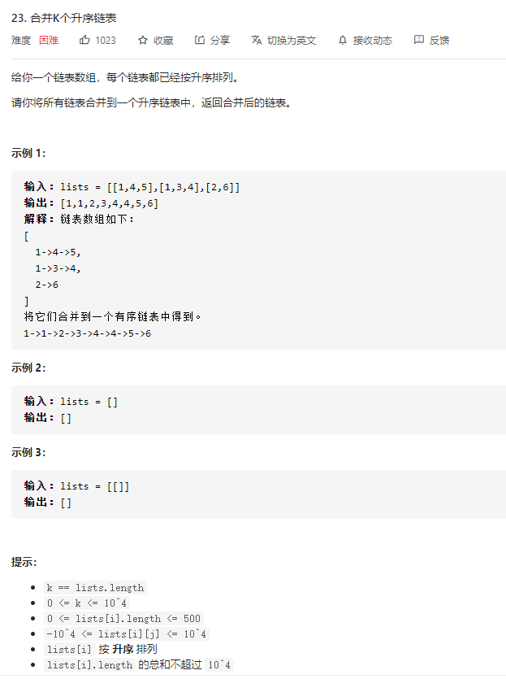

### leetcode_23_hard_合并k个升序链表




```c++
/**
 * Definition for singly-linked list.
 * struct ListNode {
 *     int val;
 *     ListNode *next;
 *     ListNode() : val(0), next(nullptr) {}
 *     ListNode(int x) : val(x), next(nullptr) {}
 *     ListNode(int x, ListNode *next) : val(x), next(next) {}
 * };
 */
class Solution {
public:
    ListNode* mergeKLists(vector<ListNode*>& lists) {
        
    }
};
```

#### 算法思路

##### 合并两个有序链表

见leetcode_21_medium_合并两个有序列表。略

##### 顺序合并

对于k个有序链表，按顺序合并入ans链表。也就是说，用一个ans来维护已经合并的链表，第i次循环把第i个链表和ans合并，答案保存到ans中。

设每个链表的最长长度是n，在第一次合并后，ans长度为n，第二次合并后，ans长度为2n。第i次合并时间复杂度为in。总的时间代价为1 * n+2 * n+3 * n + ......+k * n，时间复杂度O(k^2 * n)。空间复杂度O(1)。

##### 分治合并

优化合并过程，用分治的方法进行合并，如下图所示。


时间复杂度上，每一轮合并k/(2^i)组离岸边，每一组的时间代价是O(2^in)，故每次合并都是O(kn)。共需logk轮合并操作。总的时间复杂度O(logk * kn)

```c++
class Solution {
public:
	ListNode* mergeKLists(vector<ListNode*>& lists) {
		int i;
		vector<ListNode*> newLists;  //每次合并后,链表数量/2
		if (lists.empty())
			return nullptr;
		
		while (lists.size() > 1)
		{
			for (i = 0; i < lists.size() / 2 * 2; i+=2)  //两两合并链表
			{
				newLists.push_back(mergeTwoLists(lists[i], lists[i + 1]));
			}
			if (lists.size() % 2 == 1)  //如果链表总数是奇数 则两两合并之后还剩余一个链表
				newLists.push_back(lists[lists.size() - 1]);
			lists = newLists;
			newLists.clear();
		}
		return lists[0];
	}

	ListNode* mergeTwoLists(ListNode* l1, ListNode* l2) {
		ListNode* preHead = new ListNode(-1);  //结果头结点的前驱节点
		ListNode* pCur = preHead;

		while (l1&&l2)
		{
			if (l1->val <= l2->val)
			{
				pCur->next = l1;
				pCur = l1;
				l1 = l1->next;
			}
			else
			{
				pCur->next = l2;
				pCur = l2;
				l2 = l2->next;
			}
		}
		//l1或者l2 可能还未被合并完。  直接将链表末尾指向未合并完的链表即可
		if (l1)
			pCur->next = l1;
		if (l2)
			pCur->next = l2;
		return preHead->next;
	}
};
```