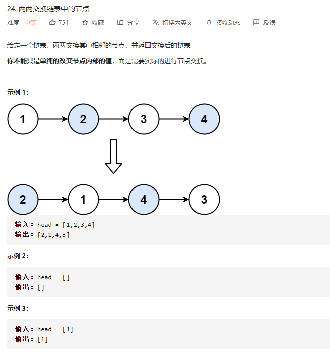
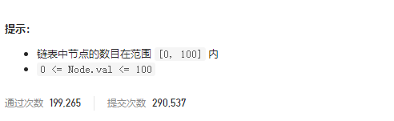

### leetcode_24_两两交换链表中的节点





```c++
/**
 * Definition for singly-linked list.
 * struct ListNode {
 *     int val;
 *     ListNode *next;
 *     ListNode() : val(0), next(nullptr) {}
 *     ListNode(int x) : val(x), next(nullptr) {}
 *     ListNode(int x, ListNode *next) : val(x), next(next) {}
 * };
 */
class Solution {
public:
    ListNode* swapPairs(ListNode* head) {
        
    }
};
```

#### 算法思路

迭代访问ListNode* pCur，并交换pCur后面的两个节点

- 构造head的前驱结点pPreHead，从该节点开始遍历
- 如果pCur后面有两个节点，则交换这两个节点。如果pCur后面只有一个节点，则无需变动。
- 交换节点的方式如下图所示


```c++
class Solution {
public:
	ListNode* swapPairs(ListNode* head) {
		ListNode* pPreHead = new ListNode(-1);  //头结点的前驱节点
		ListNode* pCur = pPreHead;  //准备翻转的节点 为pCur的后两个节点
		ListNode *pTemp;  //待翻转两个节点当中的第一个节点

		pPreHead->next = head;
		while ((pTemp=pCur->next) && pTemp->next)  //判断pCur后面还有两个节点
		{
			//翻转pCur后面的两个节点
			pCur->next = pTemp->next;
			pTemp->next = pTemp->next->next;
			pCur->next->next = pTemp;
			pCur = pTemp;
		}
		return pPreHead->next;
	}
};
```

