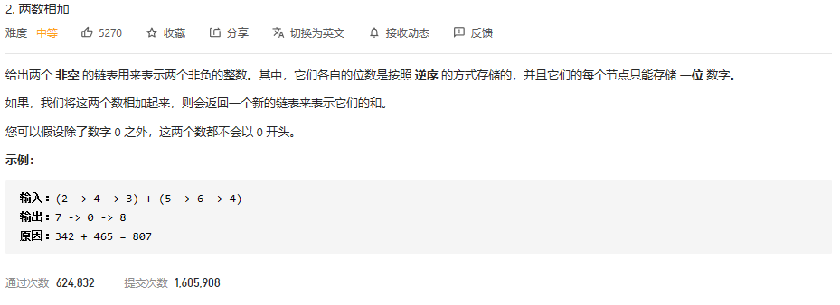

### leetcode_2_medium_两数相加



```c++
/**
 * Definition for singly-linked list.
 * struct ListNode {
 *     int val;
 *     ListNode *next;
 *     ListNode() : val(0), next(nullptr) {}
 *     ListNode(int x) : val(x), next(nullptr) {}
 *     ListNode(int x, ListNode *next) : val(x), next(next) {}
 * };
 */
class Solution {
public:
    ListNode* addTwoNumbers(ListNode* l1, ListNode* l2) {
        
    }
};
```

本题思路很简单，两个十进制数按位相加，用一个add值存储是否有进位即可

#### 注意点

- 链表题目，可以多申请一个空间，作为结果链表头结点的前驱结点。从而方便对每个结果节点执行相同的操作
- **链表访问next**时，一定要逻辑上确定当前指针不是**nullptr**
- 对于本题，循环终止条件 还要判断进位add是否为1。若还有进位的话，则循环尚未终止

```c++
class Solution {
public:
	ListNode* addTwoNumbers(ListNode* l1, ListNode* l2) {
		int nCur;  //当前位数值
		int add=0;  //进位标志
		ListNode* pHead=new ListNode();  //结果的前驱节点
		ListNode* pCur=pHead;  //当前访问的节点
		while (l1 || l2 ||add)  //注意循环终止条件 如果进位有数值的话 不能终止
		{
			//计算当前位
			nCur = 0;
			if (l1)
			{
				nCur += l1->val;
				l1 = l1->next;
			}
			if (l2)
			{
				nCur += l2->val;
				l2 = l2->next;
			}
			nCur += add;
			if (nCur >= 10)
			{
				add = 1;
				nCur -= 10;
			}
			else
				add = 0;
			//赋值
			pCur->next = new ListNode(nCur);
			//向下个节点访问
			pCur = pCur->next;
		}
		return pHead->next;
	}
};
```

