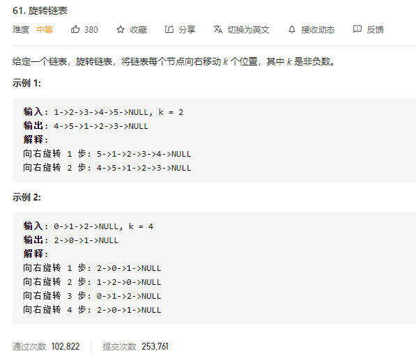

### leetcode_61_medium_旋转链表



```c++
/**
 * Definition for singly-linked list.
 * struct ListNode {
 *     int val;
 *     ListNode *next;
 *     ListNode() : val(0), next(nullptr) {}
 *     ListNode(int x) : val(x), next(nullptr) {}
 *     ListNode(int x, ListNode *next) : val(x), next(next) {}
 * };
 */
class Solution {
public:
    ListNode* rotateRight(ListNode* head, int k) {

    }
};
```

#### 算法思路

旋转链表，不会改变链表的元素，只会改变连接的方式。对于一般情况(0<k<length)，即:

- 原链表的尾节点，其next指针指向原链表的头结点
- 原链表的中间某处，变为末尾节点，其next指针指向nullptr
- 返回新的链表头结点

这题只需理清这几个节点的位置，对它们作相应的改变即可

注意，对于k，要取**k=k%length**，避免多次无效的翻转

```c++
class Solution {
public:
	ListNode* rotateRight(ListNode* head, int k) {
		int i,length;
		ListNode* newHead, *last,*cur;

		if (head == nullptr)  //链表为空的特殊情况
			return nullptr;
		//第一遍扫描 计算链表长度，找到末尾节点
		cur = head;
		length = 1;
		while (cur->next)
		{
			cur = cur->next;
			length++;
		}
		last = cur;  //记录原链表的末尾节点
		//第二遍扫描 旋转链表
		k = k % length;  //旋转length次相当于不进行旋转
		last->next = head;
		i = 0;
		cur = head;
		while (i != length - k - 1)
		{
			cur = cur->next;
			i++;
		}
		newHead = cur->next;  //新的头结点
		cur->next = nullptr;  //新的尾节点
		return newHead;
	}
};
```

